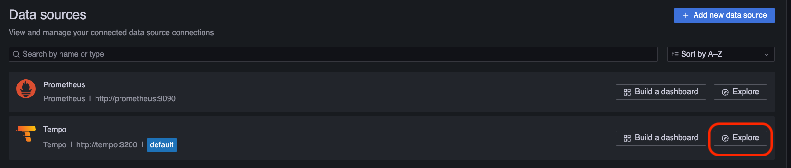

# Prometheus and Grafana monitoring for `iota-private-network`

This docker-compose configuration allows launching instances of the Prometheus and Grafana applications for monitoring of locally deployed `iota-private-network`.

In order to run this monitoring setup, you first need to have `iota-private-network` setup running, because it creates the network that Prometheus and Grafana join.

To deploy the setup, simply run `docker compose up -d`.

## Span tracing with Tempo

This setup also includes a Tempo instance for span tracing. The IOTA nodes are configured to send spans to the Tempo instance, which can be visualized in Grafana.

Take care of the ports alignment in `tempo.yaml` and `docker-compose.yaml`. The default ports are `4317` for gRPC and `4318` for HTTP.

To navigate to the Tempo UI, open Grafana and go to "Data Sources". Select "Explore" in Tempo block and you can start querying spans.


## Examining prometheus snapshots

1. Extract the snapshot tarball

```bash
tar czf prometheus-backup.tar.gz /path/to/extracted/snapshot
```

2. export the `SNAPSHOT_DIR_PATH` environment variable to point to the extracted snapshot directory

```bash
export SNAPSHOT_DIR_PATH=/path/to/extracted/snapshot
```

3. Run the following command to start a local grafana and prometheus instance with the snapshot

```bash
docker compose -f docker-compose.prom-snapshot.yaml up -d
```

4. Access grafana at `http://localhost:3000`

5. Remove the local grafana and prometheus instance after use

```bash
docker compose -f docker-compose.prom-snapshot.yaml down
```
