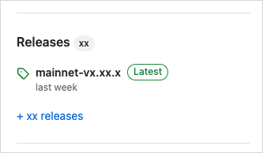

import MacosDeps from "../../_snippets/macos-deps.mdx";
import LinuxDeps from "../../_snippets/linux-deps.mdx";
import Quiz from '@site/src/components/Quiz';
import questions from '/json/developer/getting-started/install-iota.json';
import InstallBinaries from '../../_snippets/install-binary-warning.mdx';
import Binaries from '../../_snippets/lists/binaries-file-list.mdx';


In order to deploy your contracts and interact with the chains some tooling is required. IOTA has an excellent command-line tool that can be used for the most common tasks.

The simplest way to get up and running with IOTA is to [install the binary](#install-from-binaries) from the latest
release available in the [IOTA GitHub Repository](https://github.com/iotaledger/iota/). Make sure to download
the version that matches the network you want to work on.

You can also use the
convenient [docker images in the repository](https://github.com/iotaledger/iota/tree/develop/docker) to run your own
local network.

If you require full control over the installation sources and process, you can
always [build the binaries yourself from source](#install-from-source).

## Supported operating systems

IOTA supports the following operating systems:

- Linux - Ubuntu version 20.04 (Bionic Beaver) or later
- macOS - macOS Monterey or later
- Microsoft Windows - Windows 10 or later

## Install Using a Package Manager

You can use [Homebrew](https://brew.sh/) on macOS, Linux, or Windows Subsystem for Linux to install `iota`:

```bash
brew install iotaledger/tap/iota
```

## Install From Binaries

You can find a set of binaries for most operating systems with
each [IOTA release](https://github.com/iotaledger/iota/releases) that you can use to install IOTA. We recommend using
the latest stable release for the network you are working on.

<Tabs groupId="operating-systems">
<TabItem value="linux" label="Linux">

    1. Go to https://github.com/iotaledger/iota/releases.
        
    1. Click the release tagged **Latest** to open the release's page.
    1. In the **Assets** section of the release, select the .tgz compressed file that corresponds to your operating system.
    1. Extract all files from the .tgz file into the preferred location on your system. These instructions assume you extract the files into a `iota` folder at the user root of your system for demonstration purposes. Replace references to this location in subsequent steps if you choose a different directory.
    1. Once you have downloaded and extracted the `.tgz` file that matches your operating system, you should open the folder
    and install the necessary binaries. You should start with the main IOTA binary:

    <Binaries/>

    1. Add the folder containing the extracted files to your `PATH` variable. To do so, you can update your `~/.bashrc` to include the location of the `IOTA` binaries. If using the suggested location, you type `export PATH=$PATH:~/iota` and press Enter.
    1. Start a new terminal session or type `source ~/.bashrc` to load the new `PATH` value.

</TabItem>
<TabItem value="mac" label="macOS">

    1. Go to https://github.com/iotaledger/iota/releases.
        
    1. Click the release tagged **Latest** to open the release's page.
    1. In the **Assets** section of the release, select the .tgz compressed file that corresponds to your operating system.
    1. Extract all files from the .tgz file into the preferred location on your system. These instructions assume you extract the files into a `iota` folder at the user root of your system. Replace references to this location in subsequent steps if you choose a different directory.
    1. Once you have downloaded and extracted the `.tgz` file that matches your operating system, you should open the folder
    and install the necessary binaries. You should start with the main IOTA binary:

    <Binaries/>

    1. Add the folder containing the extracted files to your `PATH` variable. To do so, you can update your `~/.zshrc` or `~/.bashrc` to include the location of the IOTA binaries. If using the suggested location, you type `export PATH=$PATH:~/iota` and press Enter.
    1. Start a new terminal session or type `source ~/.zshrc` (or `.bashrc`) to load the new `PATH` value.
    1. If running the binaries for the first time, you might receive an error from MacOS that prevents the binaries from running. If you receive this error, close the dialog and type `xattr -d com.apple.quarantine ~/iota/*` in your terminal and press Enter (be sure to adjust the path if different). 

</TabItem>
<TabItem value="win" label="Windows">

    1. Go to https://github.com/iotaledger/iota/releases.
        
    1. Click the release tagged **Latest** to open the release's page.
    1. In the **Assets** section of the release, select the .tgz compressed file that corresponds to your operating system.
    1. Extract all files from the .tgz file into the preferred location on your system. These instructions assume you extract the files into a `iota` folder at the root of your C drive. Replace references to this location in subsequent steps if you choose a different directory.

    :::info 

    Older versions of Windows do not natively support .tgz files, but you can use a free app like [7Zip](https://7-zip.org/) to extract them.

    :::

    1. Navigate to the expanded folder. You should have the following extracted files

    <Binaries/>

    1. Add the folder containing the extracted files to your `PATH` variable. There are several ways to get to the setting depending on your version of Windows. One way that works on all versions of Windows is to type `sysdm.cpl` in a console to open the System Properties window. Under the **Advanced** tab, click the **Environment Variables...** button.
    1. In the Environment Variables window, select the `Path` variable and click the **Edit...** button. 
    1. In the Edit environment variable window, click **New** and add the path to your expanded folder. Using the example path, this would be `C:\iota`.
    1. Click **OK**.

</TabItem>
</Tabs>

:::info 

Running binaries other than `iota` might require installing prerequisites itemized in the following section. 

:::

### Test

You can quickly test if you have successfully installed the binaries by running the following command:

```bash
iota
```

It should output a message stating the currently installed IOTA version and some helpful commands.

## Install From Source

You can use this section to install the Rust crates (packages) to interact with IOTA networks, including the IOTA CLI,
from source.

:::tip

You can also download the [source code](../advanced/iota-repository.mdx) to access files locally.

:::

### Prerequisites

Please ensure you install the following before attempting to install IOTA from source.

#### Rust and Cargo

##### Install

Like most Rust projects, IOTA uses Cargo as a package manager. You can find detailed instructions
on how to install Rust and Cargo for your OS in
the [official Rust Documentation](https://www.rust-lang.org/tools/install)

You can use the following command to install Rust and Cargo on macOS or Linux:

```bash
curl --proto '=https' --tlsv1.2 -sSf https://sh.rustup.rs | sh
```

##### Update

Since IOTA uses the latest version of Cargo to build and manage dependencies, you may need
to [update](https://www.rust-lang.org/tools/install). The recommended update method is using `rustup`, as shown below:

```bash
rustup update stable
```

#### Additional Prerequisites by Operating System

Select the appropriate tab to view the requirements for your system.

<Tabs groupId="operating-systems">

<TabItem value="linux" label="Linux">

The prerequisites needed for the Linux operating system include:

- cURL
- Rust and Cargo
- Git CLI
- CMake
- GCC
- libssl-dev
- libclang-dev
- build-essential

:::info

The Linux instructions assume a distribution that uses the APT package manager. You might need to adjust the
instructions to use other package managers.

:::

Install the prerequisites listed in this section. Use the following command to update `apt-get`:

```bash
sudo apt-get update
```

##### All Linux prerequisites

Reference the relevant sections that follow to install each prerequisite individually, or run the following to install
them all at once:

<LinuxDeps />

##### cURL

Install cURL with the following command:

```bash
sudo apt-get install curl
```

Verify that cURL is installed correctly with the following command:

```bash
curl --version
```

##### Git CLI

Run the following command to install Git, including the [Git CLI](https://cli.github.com/):

```bash
sudo apt-get install git-all
```

For more information, see [Install Git on Linux](https://github.com/git-guides/install-git#install-git-on-linux) on the
GitHub website.

##### CMake

Use the following command to install CMake.

```bash
sudo apt-get install cmake
```

To customize the installation, see [Installing CMake](https://cmake.org/install/) on the CMake website.

##### GCC

Use the following command to install the GNU Compiler Collection, `gcc`:

```bash
sudo apt-get install gcc
```

##### libssl-dev

Use the following command to install `libssl-dev`:

```bash
sudo apt-get install libssl-dev
```

If the version of Linux you use doesn't support `libssl-dev,` find an equivalent package for it on
the [ROS Index](https://index.ros.org/d/libssl-dev/).

(Optional) If you have OpenSSL, you might also need also to install `pkg-config`:

```bash
sudo apt-get install pkg-config
```

##### libclang-dev

Use the following command to install `libclang-dev`:

```bash
sudo apt-get install libclang-dev
```

If the version of Linux you use doesn't support `libclang-dev`, find an equivalent package for it on
the [ROS Index](https://index.ros.org/d/libclang-dev/).

##### build-essential

Use the following command to install `build-essential`:

```bash
sudo apt-get install build-essential
```

</TabItem>

<TabItem value="mac" label="macOS">

The prerequisites needed for the macOS operating system include:

- Rust and Cargo
- Homebrew
- cURL
- CMake
- Git CLI

MacOS includes a version of cURL that you can use to install Homebrew. Use Homebrew to install other tools, including a
newer
version of cURL.

##### Homebrew

Use the following command to install [Homebrew](https://brew.sh/):

```bash
/bin/bash -c "$(curl -fsSL https://raw.githubusercontent.com/Homebrew/install/HEAD/install.sh)"
```

:::info

You do not need to install anything else if you installed IOTA with [Homebrew](#homebrew).

:::

##### All macOS prerequisites

With Homebrew installed, you can install individual prerequisites from the following sections or install them all at
once with this command:

<MacosDeps />

##### cURL

Use the following command to update the default [cURL](https://curl.se) on macOS:

```bash
brew install curl
```

##### CMake

Use the following command to install CMake:

```bash
brew install cmake
```

To customize the installation, see [Installing CMake](https://cmake.org/install/) on the CMake website.

##### Git CLI

Use the following command to install Git:

```bash
brew install git
```

After installing Git, download and install the [Git command line interface](https://git-scm.com/download/).

</TabItem>

<TabItem value="win" label="Windows">

The prerequisites needed for the Windows 11 operating system include:

- cURL
- Rust and Cargo
- Git CLI
- CMake
- C++ build tools
- LLVM compiler

##### cURL

Windows 11 ships with an installed Microsoft version of [cURL](https://curl.se/windows/microsoft.html). If you
want to use the curl project version instead, download and install it
from [https://curl.se/windows/](https://curl.se/windows/).

##### Git CLI

Download and install the [Git command line interface](https://git-scm.com/download/).

##### CMake

Download and install [CMake](https://cmake.org/download/) from the CMake website.

##### Protocol Buffers

Download [Protocol Buffers](https://github.com/protocolbuffers/protobuf/releases) (protoc-xx.x-win32.zip or
protoc-xx.x-win64.zip) and add the \bin directory to your Windows PATH environment variable.

##### Additional tools for Windows

IOTA requires the following additional tools for computers running Windows:

- For Windows on ARM64 only - [Visual Studio 2022 Preview](https://visualstudio.microsoft.com/vs/preview/).
- [C++ build tools](https://visualstudio.microsoft.com/downloads/) is required to [install Rust](#rust-and-cargo).
- The [LLVM Compiler Infrastructure](https://releases.llvm.org/). Look for a file with a name similar to
  LLVM-15.0.7-win64.exe for 64-bit Windows or LLVM-15.0.7-win32.exe for 32-bit Windows.

</TabItem>

</Tabs>

### Install IOTA Binaries From Source

Run the following command to install IOTA binaries from the `testnet` branch:

```shell
cargo install --locked --git https://github.com/iotaledger/iota.git --branch testnet iota
```

:::info Alternative releases

Replace `testnet` with another branch if needed when working on anything besides the testnet. Common options would be `develop` for the absolute latest version, `devnet` and `mainnet`.
See the [repository details](../advanced/iota-repository.mdx) for more information on commonly used branches.

:::

The installation process can take a while to complete. You can monitor the installation progress in the terminal. If you encounter an error, install the latest version of all prerequisites and try the command again.

To update to the latest stable version of Rust:

```shell
rustup update stable
```

The command installs IOTA components in the `~/.cargo/bin` folder.

#### Additional Binaries

The `iota` binary provides client commands for interacting with the network. If you need to run a local network for development, install the `iota-localnet` binary separately:

```shell
cargo install --locked --git https://github.com/iotaledger/iota.git --branch testnet iota-localnet
```

To also enable the local indexer and GraphQL server, build with the `indexer` feature:

```shell
cargo install --locked --git https://github.com/iotaledger/iota.git --branch testnet --features indexer iota-localnet
```

:::info Requirement: PostgreSQL

Building `iota-localnet` with the `indexer` feature requires PostgreSQL to be installed on your system.

<Tabs groupId="operating-systems">

<TabItem value="linux" label="Linux">

```bash
sudo apt-get install -y libpq-dev
```

</TabItem>

<TabItem value="mac" label="macOS">

```bash
brew install libpq
```

</TabItem>

<TabItem value="win" label="Windows">

You can use Chocolatey to install PostgreSQL:

```bash
choco install postgresql
```

</TabItem>

</Tabs>

:::

For advanced tools like transaction replay, genesis ceremony, and fire drill, install `iota-tool`:

```shell
cargo install --locked --git https://github.com/iotaledger/iota.git --branch testnet iota-tool
```

### Upgrade IOTA Binaries

If you previously installed the IOTA binaries, you can update them to the most recent release with the same command you
used to install them:

```shell
cargo install --locked --git https://github.com/iotaledger/iota.git --branch testnet iota
```

<Quiz questions={questions} />
