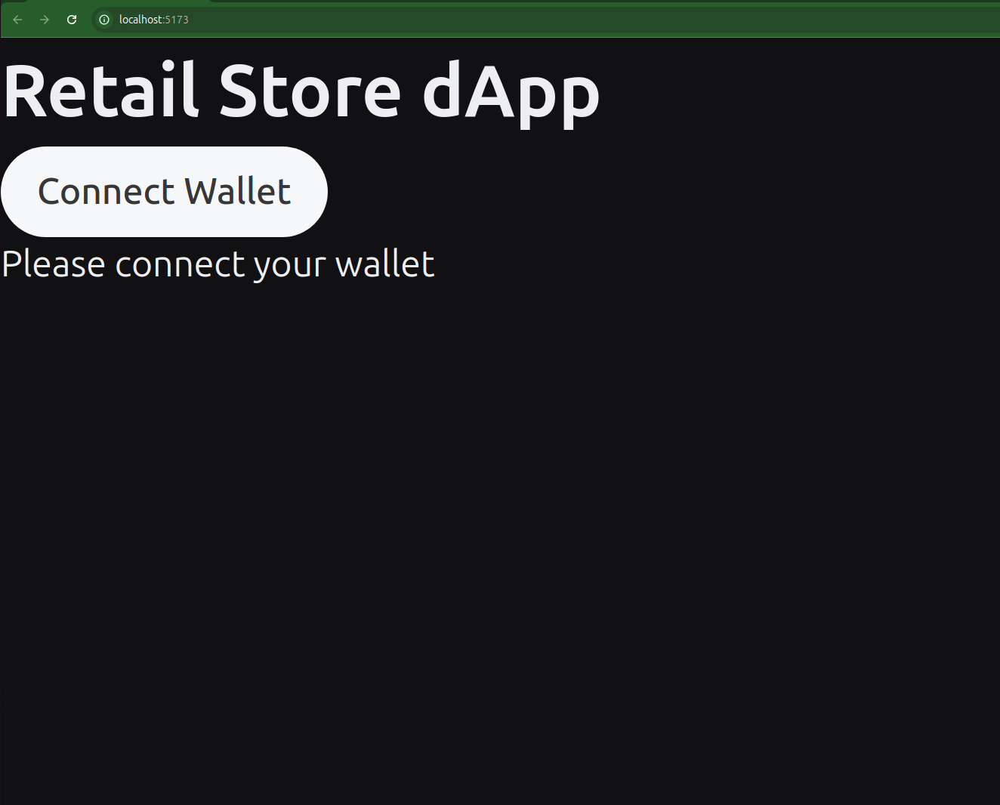
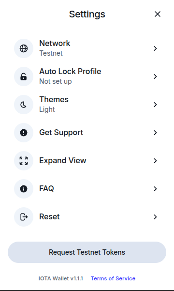
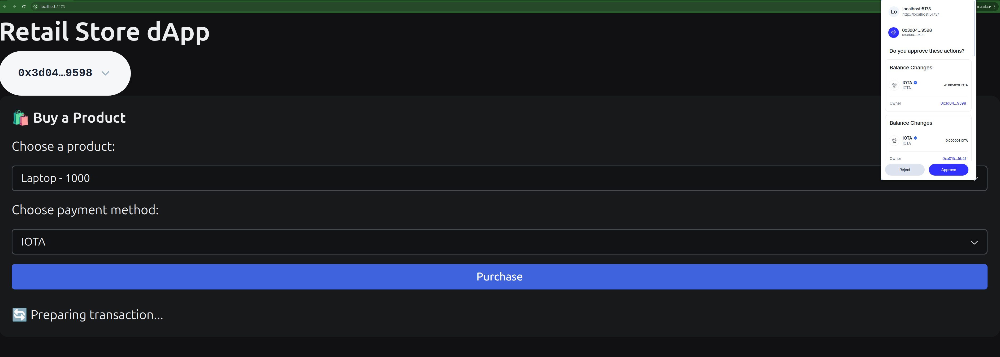
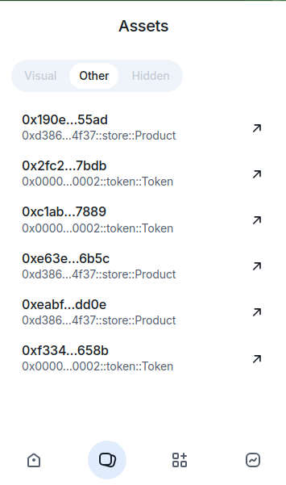
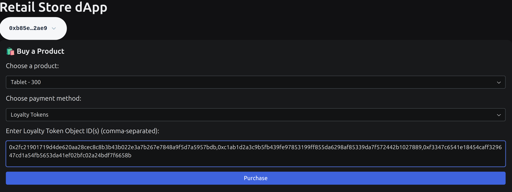

# Retail Store dApp Tutorial

Welcome to the comprehensive guide for the **IOTA Retail Store dApp**, a demo application built with React, TypeScript, and the IOTA Move stack. This dApp leverages the [Closed Loop Token (CLT) Standard](../standards/closed-loop-token.mdx), which allows for the creation of tokens with defined rules and restrictions. CLTs differ from regular fungible tokens in that they:

- Can be restricted in how and where they are transferred or spent
- Enforce spending rules directly in the smart contract logic

In this dApp, **LOYALTY tokens** are a CLT implementation:
- They are minted as rewards for IOTA purchases
- They can only be used in this app
- They must follow specific confirmation rules (like treasury approval)

This tutorial will walk you through:

- Interacting with a retail store app to purchase electronics
- Earning loyalty tokens for purchases made with IOTA
- Spending loyalty tokens to buy more products
- Understanding the backend Move smart contracts and frontend integration

We will first explore the dApp's functionality, then dive into the code to understand how it works. By the end, you'll have a solid grasp of how to build and use a dApp with IOTA's Move smart contracts and CLT standard.

---


## 2. Prerequisites & Setup

Before diving in, ensure you have the following tools installed:

- **Node.js** (v18+ recommended)
- **pnpm**: `npm install -g pnpm`
- **IOTA CLI**: [Installation Guide](https://docs.iota.org/developer/getting-started/install-iota)

For detailed setup and environment configuration, please refer to the [README](https://github.com/iota-community/loyalty-points-for-retailers/blob/main/README.md) file in the repository.

### Running the dApp

1. **Install dependencies**:

```bash
pnpm install
```

2. **Start the development server**:

```bash
pnpm dev
```

Your app will be available at `http://localhost:5173`.

---

## 3. Using the dApp

### 3.1 Buying 3 Laptops with IOTA

Each Laptop we buy will give us 100 LOYALTY tokens. We will use those to buy a Tablet later.

1. Open the dApp in your browser, connect your wallet and request some IOTA tokens from the faucet:


then navigate to **settings** and request some IOTA tokens from the faucet:



2. Select **Laptop** from the dropdown, and choose **IOTA** as your payment method
3. Click **Purchase**


### 3.2 Verifying Wallet Contents

After purchasing, return to the dApp interface and check that the product and loyalty tokens are reflected in your wallet view.



### 3.3 Buying a Tablet with Loyalty Tokens

1. Select **Tablet** in the app choose **LOYALTY** as payment. Then, copy your `Token<LOYALTY>` object IDs, 


:::note
> If you enter more than one token, the app will automatically create **two transactions**:
> 1. One to **merge** the tokens using `token::join`
> 2. Another to **purchase** using the first token (now holding the full balance)
> If you enter only one token, it will directly call the purchase function.
:::

---

## 4. Dive Into the Code

### 4.1 Move Smart Contracts

We have two main modules in the `sources` folder:
- `store.move`: Handles product purchases and loyalty token minting
- `loyalty.move`: Manages loyalty token minting and transfer

#### `store.move`
##### `buy_product_with_iota`
This function handles the purchase of products using IOTA. It mints loyalty tokens as rewards for purchases.
```move reference
https://github.com/iota-community/loyalty-points-for-retailers/blob/main/move/loyalty_points_package/sources/loyalty_points.move#L41-L81
```


##### `buy_product_with_loyalty`
This function allows users to purchase products using loyalty tokens. It checks if the token is valid and if the user has enough balance.
```move reference
https://github.com/iota-community/loyalty-points-for-retailers/blob/main/move/loyalty_points_package/sources/loyalty_points.move#L84-L115
```

#### `loyalty.move`
##### `reward_user`
```move reference
https://github.com/iota-community/loyalty-points-for-retailers/blob/main/move/loyalty_points_package/sources/loyalty_coin.move#L73-L83
```


### 4.2 Frontend Code Walkthrough

The frontend handles three main functionalities:
1. **Purchase Products With IOTA**: Users can buy products using IOTA.
2. **Purchase Products With a single LOYALTY token**: Users can buy products using a single loyalty token that has enough balance.
3. **Purchase Products With Multiple LOYALTY tokens**: Users can buy products using multiple loyalty tokens that will be merged into one.

#### Purchase with IOTA
```tsx reference
https://github.com/iota-community/loyalty-points-for-retailers/blob/main/src/BuyProduct.tsx#L40-L68
```


#### Purchase with One Loyalty Token
```tsx reference
https://github.com/iota-community/loyalty-points-for-retailers/blob/main/src/BuyProduct.tsx#L91-L117
```

#### Payment with Multiple Loyalty Tokens (two txs)
```tsx reference
https://github.com/iota-community/loyalty-points-for-retailers/blob/main/src/BuyProduct.tsx#L117-L168
```
---

## 5. Conclusion
In this tutorial, we explored the IOTA Retail Store dApp, focusing on its functionality and the underlying Move smart contracts. We learned how to use the TS SDK to interact with the dApp, purchase products, and earn loyalty tokens.

