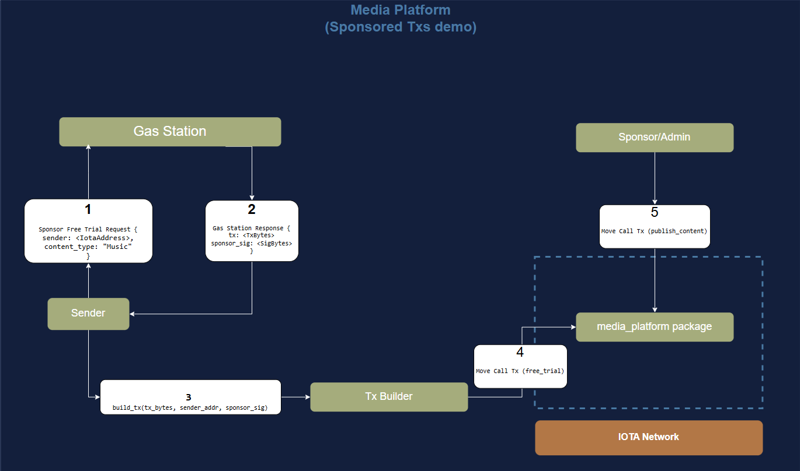

# The Gas Station Server

:::info
This guide is for developers who want to build their own gas station. If you'd rather just use sponsored transactions, IOTA provides a [Gas Station Component](../../../operator/gas-station/gas-station.mdx) that you can deploy in your environment.
:::

## Architecture and Flow Overview

The workflow of the sponsored transaction is as follows:
    - A user who does not have an IOTA balance wants to subscribe to the free trial option. They will send a request to the Gas Station server to sponsor their transaction alongside content type (Music, News or Movies).
    - The Gas Station server will verify that this user has not used the free trial option before. If the user is eligible, the Gas Station will build a transaction (with gas payment from the sponsor's balance), sign it, and send back both the transaction and the signature separately as the response.
    - The user, having received the transaction and the sponsor's signature, will sign the transaction and send it to the IOTA network. The user can do this using the [CLI](../../../developer/references/cli.mdx), [Rust SDK](../../../developer/references/rust-sdk.mdx) or [TS SDK](../../../developer/ts-sdk/typescript/install.mdx). In this part, we will use the Rust SDK.
    - The sponsor/admin (they can be different addresses, but for simplicity, we will assume they are the same) can now call the `publish` content function on the platform to publish the content to the user's address.




The Gas Station server is responsible for verifying the user's eligibility for the free trial, building the transaction, and signing it. The server's response will include the transaction and the sponsor's signature.
We will use [axum](https://docs.rs/axum/latest/axum/) as the web framework for the Gas Station server. However, you can use any web framework you are comfortable with.

To start, create a new rust project called `gas_station_server` by running the following command:

```bash
cargo new gas_station_server
```
You can now open the `gas_station_server` directory with your IDE of choice and add the following dependencies to your `Cargo.toml` file. We will see their usage as we go through the code:

```toml reference
https://github.com/iota-community/sponsored-transactions-demo/blob/cbad19470d6dcdc3dbd3222946381719628fa015/backend/Cargo.toml#L7-L23
```

Next, you should update the Gas Station's `main` function in the `src/main.rs` file with the following code:

:::info
This implementation of a gas station server has a simple implementation of a shared state to keep track of addresses in memory. In a real-world application, you should use a database to store this information.
:::

```rust reference
https://github.com/iota-community/sponsored-transactions-demo/blob/cbad19470d6dcdc3dbd3222946381719628fa015/backend/src/main.rs#L124-L150
```
:::note
For the imported code to work, you need to paste all the code from the [Github repository](https://github.com/iota-community/sponsored-transactions-demo) into the respective files.
:::


Technically, the gas Station server has two routes:
1. The root route `/` will return a welcome message.
2. The `/sign_and_fund_transaction` route will handle the user's request to sponsor the free trial. This route will call the `sign_and_fund_transaction` function, which we will implement next.


Next, we will implement the `sign_and_fund_transaction` function, which will be called when the user sends a request to the `/sign_and_fund_transaction` route. This function will verify the user's eligibility, build the transaction, sign it, and return the transaction and the sponsor's signature.
:::note
Change the sponsor address to the address you want to use
:::
```rust reference
https://github.com/iota-community/sponsored-transactions-demo/blob/cbad19470d6dcdc3dbd3222946381719628fa015/backend/src/main.rs#L63-L122
```

The function `sign_and_fund_transaction` will:
1. Check if the user has already requested funds. If they have, it will return a conflict status.
2. Add the user's address to the set of addresses that have requested funds.
3. Build a signed and funded transaction using the `sign_and_fund_transaction` util function, which we will implement next.
4. Increase the total sponsored fees by the gas price. The sponsor uses this to track expenses.
5. Respond with the transaction bytes and the sponsor's signature.

Next, we will implement the `sign_and_fund_transaction` util function, which will build the transaction, sign it, and return the signed transaction.
Create a file called `utils.rs` in the `src` directory, and add the following code:

```rust reference
https://github.com/iota-community/sponsored-transactions-demo/blob/cbad19470d6dcdc3dbd3222946381719628fa015/backend/src/utils.rs#L119-L208
```

This function will:
1. Build a programmable transaction that calls the `free_trial` function of the `sponsored_transactions_packages` package.
2. Get the sponsor's gas coin.
3. Create a transaction data object with the programmable transaction, gas budget, gas price, and sponsor address.
4. Sign the transaction by the sponsor.
5. Return the signed transaction.


Finally, we can now run the server and call the `/sign_and_fund_transaction` route to sponsor the free trial. The server will return the transaction bytes and the sponsor's signature, which the user can use to send the transaction to the IOTA network.

In a terminal, run the server with the following command:

```shell
cargo run
```

In another terminal, send a POST request to the /sign_and_fund_transaction route with the following cURL call (replace the sender address and content type with your own):
```shell
curl -X POST \
    -H "Content-Type: application/json" \
    -d '{
        "sender": "0xc7d158a9b05c6dfd07c233649c9e0f78320d066e5ac0e8f5101de500ad9e84e8",
        "content_type": "Music"
    }' \
    http://localhost:3001/sign_and_fund_transaction
```

The server will return the transaction bytes and the sponsor's signature, which the user can use to send the transaction to the IOTA network.

```json
{
"message":"Transaction signed and funded successfully",
"bytes":"AAACAAYFTXVzaWMBAbBSNubKBn4/oRS6sVWPNeRAl+AHiqaBdh+qYiIIWKF2DhQAAAAAAAABAQAgaekcgzM1C99rvSmRJmrTOZJ1fbevSCka21jnpbDhqh9zcG9uc29yZWRfdHJhbnNhY3Rpb25zX3BhY2thZ2VzCmZyZWVfdHJpYWwAAgEAAAEBAMfRWKmwXG39B8IzZJyeD3gyDQZuWsDo9RAd5QCtnoToATnqmj+YicH8PXnWPZeuKTp0hZ0M4Lh2wJAhFHHjcGe7ERQAAAAAAAAgAakPl91BjzezX1DLa+BnLWkJ5k0vnTX6/Qg/iJw11gW/KTztJZMRjNIx8QfzQbsa2ds5zQSXv/KdNVcwz04rwugDAAAAAAAAQEtMAAAAAAAA",
"sigs":["ACCPERsBa2Wt7TFO1p7KDbDI5epikVJEmwvE3yLKv3nuMvgMVFZbh9EJ0kQjLAlHGfUaYMEvrZuNMSuR7zOqrA/p1vxEC3McO9IvqEI8BXaHBgCUFx3DXTO+QWmQKwj2uA=="]
}
```


For the full code of the Gas Station server, you can check the [Gas Station server implementation](https://github.com/iota-community/sponsored-transactions-demo/blob/cbad19470d6dcdc3dbd3222946381719628fa015/backend/src/main.rs)


