# Rapid dApp Development with dapp-kit (Building VoucherShop)

## Overview

In this comprehensive workshop, you'll experience the power of [IOTA dApp kit](../../developer/ts-sdk/dapp-kit/) - a complete toolkit that revolutionizes how developers build decentralized applications on the IOTA network. We'll build a production-ready VoucherShop dApp where users can claim exclusive vouchers and redeem them for limited edition NFT collectibles, all while showcasing how dApp Kit eliminates the traditional complexities of blockchain development.

**What makes this workshop special**: Instead of wrestling with wallet integration, transaction handling, and state management, you'll leverage pre-built components and hooks that handle everything automatically. This is dApp development reimagined - fast, intuitive, and powerful.

## Why IOTA dApp Kit?

The IOTA dApp Kit provides everything you need for rapid dApp development:

- **Pre-built UI Components** - Beautiful, accessible components like [ConnectButton](/developer/ts-sdk/dapp-kit/wallet-components/ConnectButton) for instant wallet integration
- **IOTA dApp Kit Hooks in Action** - Powerful hooks like [useSignAndExecuteTransaction](/developer/ts-sdk/dapp-kit/wallet-hooks/useSignAndExecuteTransaction) that abstract away transaction complexity
- **Automatic State Management** - Real-time wallet and connection state out of the box
- **Multi-Wallet Support** - Works with all [IOTA wallets automatically](/developer/ts-sdk/dapp-kit/wallet-hooks/useAutoConnectWallet)
- **TypeScript Native** - Full type safety for confident development
- **Theming System** - Consistent, beautiful UIs with custom branding

## What We're going to build: VoucherShop dApp

The VoucherShop is a complete NFT marketplace where:

**For Users:**

- **One-Click Wallet Connection** - Connect any IOTA wallet with a single component
- **Voucher Claims** - Claim exclusive one-time vouchers for NFT access
- **NFT Storefront** - Browse beautiful digital collectibles with rich metadata
- **Voucher Redemption** - Redeem vouchers for transferable NFT assets
- **Celebration Experience** - Enjoy confetti animations for successful transactions

**For Admins:**

- **Smart Contract Management** - Deploy and manage the VoucherShop Move package
- **NFT Catalog Control** - Add and manage NFT templates in the catalog
- **Contract Configuration** - Set up network variables for dApp integration


## Prerequisites

- [Node.js](https://nodejs.org/en) >= v22.14.0
- [npx](https://www.npmjs.com/package/npx) >= 11.4.2
- [iota CLI](https://github.com/iotaledger/iota/releases) >= 1.5.0
- [TS SDK knowledge](/developer/ts-sdk/typescript)
- Basic knowledge of React and TypeScript

## Create a Move Package

We start by creating a Move package for our VoucherShop contract. This sets up the project structure, scaffolds the necessary files, and prepares the environment to implement blockchain logic. Once the package is created, we'll explore the package structure and understand how the voucher and NFT functionality will be implemented.

Run the following command to [create a Move package](/developer/getting-started/create-a-package):

```bash
iota move new voucher_shop && cd voucher_shop
```

## Package Overview

### Struct and Constants

- [Voucher](https://github.com/iota-community/workshops/tree/main/workshop-module-8/voucher_shop/sources/voucher_shop.move#L17-L21) - One-time voucher resource stored per user, tracks usage status
- [NFTMetadata](https://github.com/iota-community/workshops/tree/main/workshop-module-8/voucher_shop/sources/voucher_shop.move#L24-L29) - NFT template metadata managed by admin in the catalog
- [VoucherNFT](https://github.com/iota-community/workshops/tree/main/workshop-module-8/voucher_shop/sources/voucher_shop.move#L34-L42) - Transferable NFT object minted on redemption with rich metadata
- [VoucherShop](https://github.com/iota-community/workshops/tree/main/workshop-module-8/voucher_shop/sources/voucher_shop.move#L45-L52) - Core shared object managing vouchers, catalog, admin, and redemption history

### Events

- [NFTAdded](https://github.com/iota-community/workshops/tree/main/workshop-module-8/voucher_shop/sources/voucher_shop.move#L56-L59) - Emitted when admin adds new NFT template to catalog
- [VoucherClaimed](https://github.com/iota-community/workshops/tree/main/workshop-module-8/voucher_shop/sources/voucher_shop.move#L61-L63) - Emitted when user successfully claims a voucher
- [NFTRedeemed](https://github.com/iota-community/workshops/tree/main/workshop-module-8/voucher_shop/sources/voucher_shop.move#L65-L68) - Emitted when user redeems voucher for NFT

### Error Codes

- [EAlreadyClaimed](https://github.com/iota-community/workshops/tree/main/workshop-module-8/voucher_shop/sources/voucher_shop.move#L7) - User has already claimed a voucher
- [ENoVoucher](https://github.com/iota-community/workshops/tree/main/workshop-module-8/voucher_shop/sources/voucher_shop.move#L8) - User doesn't have a voucher to redeem
- [EVoucherUsed](https://github.com/iota-community/workshops/tree/main/workshop-module-8/voucher_shop/sources/voucher_shop.move#L9) - Voucher has already been used for redemption
- [EInvalidNFT](https://github.com/iota-community/workshops/tree/main/workshop-module-8/voucher_shop/sources/voucher_shop.move#L10) - NFT template doesn't exist in catalog
- [ENotAdmin](https://github.com/iota-community/workshops/tree/main/workshop-module-8/voucher_shop/sources/voucher_shop.move#L11) - Caller is not the admin, unauthorized action
- [ENftAlreadyExists](https://github.com/iota-community/workshops/tree/main/workshop-module-8/voucher_shop/sources/voucher_shop.move#L12) - NFT template ID already exists in catalog
- [ENoCatalog](https://github.com/iota-community/workshops/tree/main/workshop-module-8/voucher_shop/sources/voucher_shop.move#L13) - No NFT templates available in catalog

## Frontend Overview

Now that we've built our Initial VoucherShop Move contract setup, let's create a modern, responsive frontend using the **IOTA dApp Kit** showcasing how rapidly we can build production-ready dApps with pre-built components and hooks.

### Rapid Setup with create-dapp

The IOTA dApp Kit provides a CLI tool (@iota/create-dapp) that scaffolds a complete React application in seconds:

```bash
pnpm create @iota/dapp
```
This command generates a fully functional dApp project structure with all necessary dependencies, configurations, and example code to get started quickly.

:::note

For initial setup of dApp structure and dependencies, you should must visit the [IOTA dApp Kit creation](/developer/ts-sdk/dapp-kit/create-dapp) for detailed instructions.
:::

**When prompted, select `react-client-dapp` - this template provides**:

- Pre-configured React + TypeScript + Vite setup
- IOTA dApp Kit already integrated
- Radix UI components for beautiful interfaces
- ESLint for code quality
- Ready-to-use wallet connection logic


:::note

[IOTA dApp kit](../../developer/ts-sdk/dapp-kit/)

Select the following options when prompted:

Which starter template would you like to use? …
▸ `react-client-dapp` React Client dApp that reads data from wallet and the blockchain
▸ `react-e2e-counter` React dApp with a move smart contract that implements a distributed counter

you have to select `react-client-dapp`
:::

### Install required dependencies:

```bash
pnpm install
```

### Core dependencies include:

- `@iota/dapp-kit` for blockchain interaction and wallet connection

- `@radix-ui/themes` and `@radix-ui/react-tabs` for UI components and styling

- `react-router-dom` for client-side routing

- `@tanstack/react-query` for data fetching and caching

### Frontend folder/file Structure

```text
.
├── eslint.config.js
├── index.html
├── package-lock.json
├── package.json
├── pnpm-lock.yaml
├── prettier.config.cjs
├── README.md
├── src
│   ├── App.tsx
│   ├── AvailableVouchers
│   │   ├── AvailableVouchers.tsx
│   │   ├── AvailableVouchersContent.tsx
│   │   └── AvailableVouchersHeader.tsx
│   ├── components
│   │   ├── ClaimVoucher.tsx
│   │   ├── Home.tsx
│   │   ├── molecules
│   │   │   ├── Button.tsx
│   │   │   ├── CelebrationModal.tsx
│   │   │   ├── Loading.tsx
│   │   │   └── Tooltip.tsx
│   │   ├── NFTStorefront.tsx
│   │   ├── RedeemVoucher.tsx
│   │   └── VoucherStatus.tsx
│   ├── constants
│   │   └── index.ts
│   ├── contexts
│   │   ├── CelebrationContext.tsx
│   │   └── index.ts
│   ├── hooks
│   │   └── useVoucherShop.ts
│   ├── index.css
│   ├── main.tsx
│   ├── networkConfig.ts
│   ├── OwnedObjects.tsx
│   ├── theme
│   │   └── darkTheme.ts
│   ├── types
│   │   └── index.ts
│   ├── utils
│   │   ├── errorHandling.ts
│   │   └── transactions
│   │       ├── claimVoucher.ts
│   │       └── redeemVoucher.ts
│   ├── vite-env.d.ts
│   └── WalletStatus.tsx
├── tsconfig.json
├── tsconfig.node.json
└── vite.config.ts
```

### Core dApp Kit Integration

The scaffolded app comes with essential providers pre-configured in `main.tsx`:

```move reference
https://github.com/iota-community/workshops/tree/main/workshop-module-8/vouchershop-frontend/src/main.tsx#L1-L34
```

**What's happening here**:

`IotaClientProvider` - Manages blockchain RPC connections
`WalletProvider` - Handles all wallet state
`QueryClientProvider` - Powers data fetching with React Query
`autoConnect` - Reconnects to last used wallet on page load
`theme` - Applies your brand colors

**Set Up Network Configuration**

:::note

Below Set Up Network Configuration is to be done after complete implementation and deploying the Move package:

Make sure to replace `<packageId>` and `<voucherShopObject>` with actual object IDs from your deployment.

:::

Add the following variables in the `networkConfig.ts`:

```typescript
import { getFullnodeUrl } from "@iota/iota-sdk/client";
import { createNetworkConfig } from "@iota/dapp-kit";

const { networkConfig, useNetworkVariable } = createNetworkConfig({
  devnet: {
    url: getFullnodeUrl("devnet"),
    variables: {
      packageId: "",
      voucherShopObject: ""
    }
  },
  testnet: {
    url: getFullnodeUrl("testnet"),
    variables: {
      packageId: "",
      voucherShopObject: ""
    }
  }
});

export { useNetworkVariable, networkConfig };
```

**One-Click Wallet Connection**

- **Connect Interface**

The elegant ConnectButton component providing one-click wallet integration with all IOTA-compatible wallets.

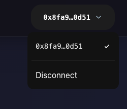

The [ConnectButton](/developer/ts-sdk/dapp-kit/wallet-components/ConnectButton) component provides instant wallet integration:

```javascript reference
https://github.com/iota-community/workshops/tree/main/workshop-module-8/vouchershop-frontend/src/App.tsx#L1-L75
```

### Files Overview

**Core Files**
- main.tsx - Application entry point with dApp Kit providers configuring blockchain RPC, wallet connections, and data caching.
- App.tsx - Root component with routing, layout, and `ConnectButton` integration from dApp Kit.
- networkConfig.ts - Network configuration using createNetworkConfig for multi-environment contract management.

**User Components**
- Home.tsx - Main dashboard showing wallet status, operation selection, and real-time shop analytics.
- ClaimVoucher.tsx - Voucher claiming interface using useSignAndExecuteTransaction with pre-validation.
- NFTStorefront.tsx - NFT catalog browser fetching templates from blockchain with rich metadata display.
- RedeemVoucher.tsx - NFT redemption interface with voucher validation and celebration integration.
- VoucherStatus.tsx - Real-time voucher state display using useCurrentAccount and blockchain queries.
- OwnedObjects.tsx - User's NFT collection viewer querying owned VoucherNFT objects.
- WalletStatus.tsx - Wallet connection information displaying current address and status.

**Shop Overview Components**
- AvailableVouchers.tsx - Main shop dashboard fetching comprehensive blockchain data with ts sdk move calls.
- AvailableVouchersHeader.tsx - Dashboard header with quick stats and real-time status indicators.
- AvailableVouchersContent.tsx - Shop details showing contract info, user status, and available actions.

**Reusable UI Components**
- Button.tsx - Custom button with loading states, tooltips, and Radix UI integration.
- Loading.tsx - Animated loading indicator with pulse effects for async operations.
- Tooltip.tsx - Information tooltip with animated pop-up and accessibility features.
- CelebrationModal.tsx - Success overlay with confetti animation and NFT display.

**Custom Hooks**
- useVoucherShop.ts - Central blockchain interaction hook wrapping dApp Kit hooks for voucher claims, NFT redemptions, and state management.

**Context Providers**
- CelebrationContext.tsx - Success animation manager providing triggerCelebration() function app-wide.

**Utility Functions**
- errorHandling.ts - Blockchain error parser mapping Move contract codes to user-friendly messages.
- transactions/ - Transaction builders for claim and redemption Move calls.

**Type Definitions**
- types/index.ts - Shared TypeScript types for NFT metadata, shop state, errors, and component props.

**Theme Customization**
- darkTheme.ts - Custom dApp Kit theme implementing dark color palette and branding.

**IOTA dApp Kit Integration**
- The frontend leverages IOTA dApp Kit for rapid development:
- `ConnectButton` for instant wallet integration
- useSignAndExecuteTransaction() for simplified blockchain calls
- useCurrentAccount() for wallet state management
- createNetworkConfig() for environment-specific setup
- Automatic loading states and error handling
- Full TypeScript support with type inference

### Start Development Server

Run the dev server to launch your dApp locally:

```bash
pnpm run dev
```

- Open the provided URL (usually http://localhost:3000) in a browser to interact with the dApp.
- This section prepares the environment to launch the frontend connected to your deployed Move contract on IOTA.


## Implementation Section Layout

(**Smart Contract** (Admin/Publisher Interactions) -> **Frontend** (User Interactions) -> **Tests** For Move Package):

Our implementation follows this pattern for each feature:
- **Smart Contract** - Move Package Code with blockchain logic and Admin/Publisher Interactions
- **Frontend** - User interactions through React components  
- **Tests** - Move package tests for validation

## Implementation Overview

We'll now build the VoucherShop dApp step-by-step, adding one feature at a time.

For each feature:
1. We'll look at what the feature does in the dApp (with UI screenshot).
2. Explore the corresponding **Move smart contract** logic.
3. Implement the **frontend interaction** using IOTA dApp Kit.
4. Verify with relevant **unit tests**.

### `Initialization (create_shop Function)`

**VoucherShop Dashboard Interface**

This is the main dashboard view of the VoucherShop dApp after wallet connection. It displays real-time shop analytics, user voucher status, available NFT templates, and quick access to claim and redemption actions - all built rapidly using IOTA dApp Kit components.

- **Dashboard Interface for new user**

Main dashboard showing real-time shop analytics, available NFT templates, and quick access to claim vouchers for first-time users.

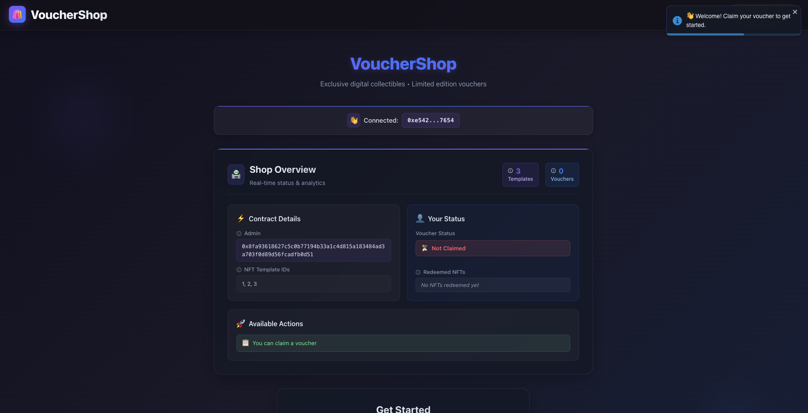

- **Dashboard Interface for existing user**

Personalized dashboard displaying user's voucher status, redemption history, and available actions based on their current state.

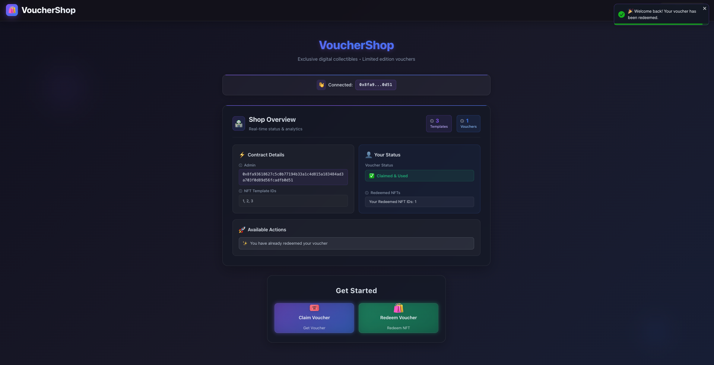

- **Already claimed voucher**

Dashboard view when user has already claimed their voucher, showing redemption-ready status and NFT browsing options.

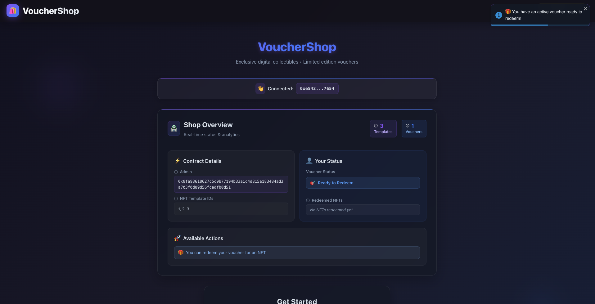

- **Tooltip Interface**

Interactive tooltips providing contextual guidance and information about various dApp features for enhanced user experience.

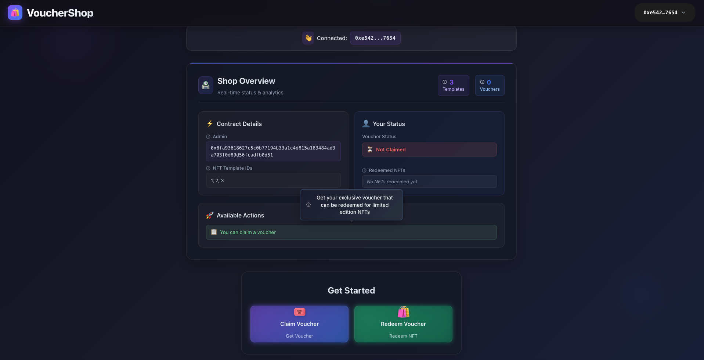

The `create_shop` function is called once at contract deployment to initialize the VoucherShop shared object on-chain. This function demonstrates how IOTA dApp Kit enables rapid dApp development by handling shared object management and blockchain state synchronization.

**Creates the main VoucherShop shared object containing:**

- `voucher_table` - Maps user addresses to their voucher status

- `catalog` - Stores NFT template metadata for redemption

- `admin` - Sets contract deployer as administrator

- `nft_ids` - Ordered list of available NFT template IDs

- `redemption_history` - Tracks user redemption patterns

**Shares the object on-chain using transfer::share_object() for multi-user access**
**Sets up the foundation for all voucher and NFT operations**


`Move Package Code:`

```move reference
https://github.com/iota-community/workshops/tree/main/workshop-module-8/voucher_shop/sources/voucher_shop.move#L72-L84
```

`Package Test Code:`

```move reference
https://github.com/iota-community/workshops/tree/main/workshop-module-8/voucher_shop/tests/voucher_shop_tests.move#L1-L40
```

## `Admin Functions`

Admin functions provide the control panel for managing the VoucherShop ecosystem, allowing authorized administrators to manage NFT templates and system configurations. These functions are protected to ensure only the contract admin can perform critical management operations, with IOTA dApp Kit handling wallet authentication and transaction signing.

`Add NFT to Catalog`

Allows the admin to add new NFT templates to the shop catalog for user redemption.

**Admin NFT Management Interface**

Admin section for managing NFT templates — showing options to add new NFT templates with metadata including name, image URI, and description, all accessible through IOTA dApp Kit's pre-built wallet connection.

`Move Package Code:`

```move reference
https://github.com/iota-community/workshops/tree/main/workshop-module-8/voucher_shop/sources/voucher_shop.move#L86-L112
```

- Verifies sender is admin using assert! with ENotAdmin error code
- Ensures NFT ID doesn't already exist to prevent duplicates
- Converts input bytes to string metadata using string::utf8
- Adds NFT metadata to catalog table and maintains ordered ID list
- Emits NFTAdded event for frontend tracking

`Remove NFT from Catalog`

Allows the admin to remove NFT templates from the catalog.

`Move Package Code:`

```move reference
https://github.com/iota-community/workshops/tree/main/workshop-module-8/voucher_shop/sources/voucher_shop.move#L114-L132
```

- Checks admin authority before allowing removal
- Validates NFT template exists in catalog
- Removes template from both catalog table and ordered ID list
- Maintains data consistency across both storage structures

`Transfer Admin Rights`

Transfers the admin role to a new address for decentralized management.

`Move Package Code:`

```move reference
https://github.com/iota-community/workshops/tree/main/workshop-module-8/voucher_shop/sources/voucher_shop.move#L134-L138
```

- Ensures only current admin can transfer adminship
- Updates admin address in VoucherShop state
- Provides smooth transition of administrative control

`Package Test Code:`

```move reference
https://github.com/iota-community/workshops/tree/main/workshop-module-8/voucher_shop/tests/voucher_shop_tests.move#L42-L111
```

### VoucherShop CLI Commands for Admin/Publisher

Now as the admin functions is complete and after deploying the Move package Admin have to run the following commands to set up the VoucherShop contract and add initial NFT templates to the catalog:

**Retrieve the PACKAGE_ID from the publish command output:**

```bash
iota client publish
```

After publishing the Move package, admins need to initialize the shop and add NFT templates using these IOTA CLI commands:

- 1. Check the Published Package

```bash
iota client object <PACKAGE_ID>
```
- 2. Initialize the Voucher Shop

```bash
iota client call --package <PACKAGE_ID> --module voucher_shop --function create_shop --gas-budget 10000000
```
This will create the VoucherShop shared object. Note the object ID from the transaction effects - we'll need it for subsequent calls.

3. Add NFT Templates (Admin Function)

As the admin (current active address), let's add some NFT templates to the catalog:

**Add first NFT template**

command example to add an NFT template with ID `1`:

```bash
iota client call --package <PACKAGE_ID> --module voucher_shop --function add_nft_to_catalog --args 0x<VOUCHER_SHOP_OBJECT_ID> 1 "Gold Voucher" "https://example.com/gold.png" "Premium gold level voucher" --gas-budget 10000000
```

Replace `<PACKAGE_ID>` and `<VOUCHER_SHOP_OBJECT_ID>` with the actual object IDs from your deployment.

## `User Functions`
User functions form the core engagement layer of our dApp, enabling participants to claim vouchers and redeem exclusive NFTs. These functions create a seamless user experience with IOTA dApp Kit handling all wallet interactions, transaction signing, and real-time state updates automatically.

### `Voucher Claim System`
The voucher claim system provides users with exclusive access to NFT redemption through one-time vouchers. IOTA dApp Kit's `useSignAndExecuteTransaction` hook simplifies the entire claim process into a single function call with automatic error handling and loading states.


`Voucher Claim Interface`

User interface to claim exclusive one-time vouchers. The pre-validation system using IOTA dApp Kit checks eligibility before transaction submission, providing instant user feedback.

- **Claim Interface**

Clean voucher claim interface with pre-validation checking eligibility before transaction submission.

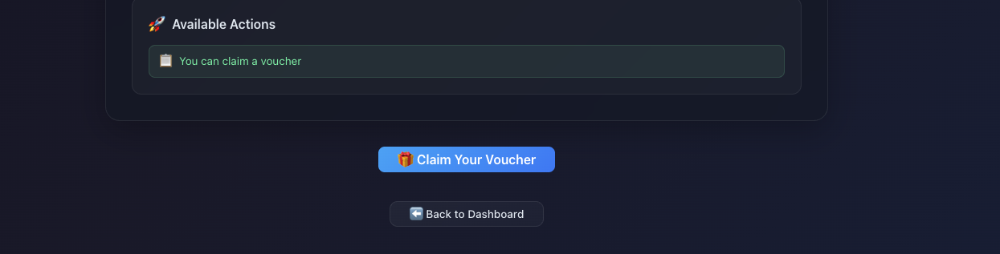

- **Validation check**

User-friendly error message with actionable suggestions when attempting to claim multiple vouchers.

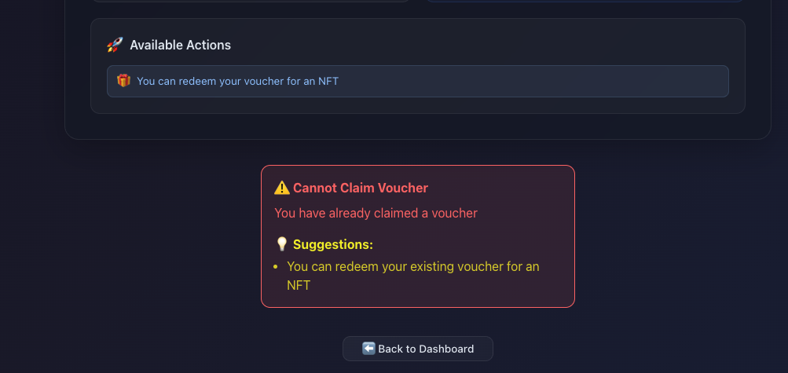

`Successful Voucher Claim`

Celebration interface showing successful voucher claim with confetti animation, automatically triggered by IOTA dApp Kit's transaction success callbacks.

- **Celebration Interface**

Confetti celebration modal automatically triggered upon successful voucher claim, enhancing user engagement.

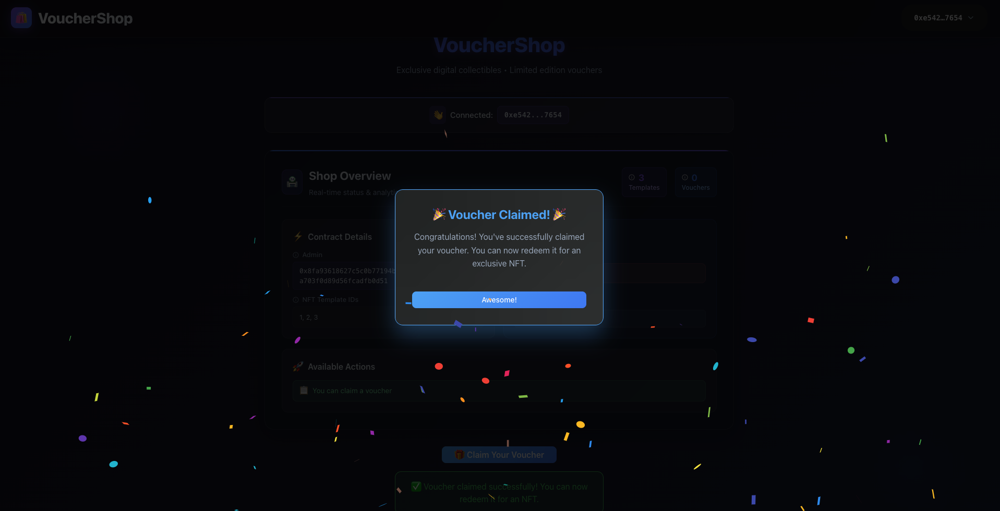

### `Claim Voucher`

Allows users to claim a one-time voucher for NFT redemption.

`Move Package Code:`

```move reference
https://github.com/iota-community/workshops/tree/main/workshop-module-8/vouchershop-frontend/src/hooks/useVoucherShop.ts#L215-L242
```

```move reference
https://github.com/iota-community/workshops/tree/main/workshop-module-8/voucher_shop/sources/voucher_shop.move#L140-L156
```

- Verifies user hasn't already claimed a voucher using address-based tracking
- Creates new Voucher resource with used: false status
- Stores voucher in user's address-keyed table entry
- Emits VoucherClaimed event for frontend tracking
- Enforces one-voucher-per-address policy

`Frontend User Interaction with IOTA dApp Kit:`

The claim process leverages IOTA dApp Kit's advanced hooks for pre-validation and seamless transaction execution:

```javascript reference
https://github.com/iota-community/workshops/tree/main/workshop-module-8/vouchershop-frontend/src/hooks/useVoucherShop.ts#L71-L105
```

`Claim Component with Automatic State Management:`

```javascript reference
https://github.com/iota-community/workshops/tree/main/workshop-module-8/vouchershop-frontend/src/components/ClaimVoucher.tsx#L1-L176
```

`Package Test Code:`

```move reference
https://github.com/iota-community/workshops/tree/main/workshop-module-8/voucher_shop/tests/voucher_shop_tests.move#L153-L231
```

## NFT Storefront and Redemption System

The NFT storefront showcases available digital collectibles with rich metadata, while the redemption system allows users to convert their vouchers into transferable NFTs. IOTA dApp Kit's and TS SDK move call and updates the NFT catalog, providing instant UI updates.

`NFT Storefront Interface`

Storefront displaying available NFT templates with images, descriptions, and selection interface - all data fetched automatically using IOTA dApp Kit's query hooks.

- **NFT Storefront**

Grid layout showcasing available NFT templates with rich metadata, images, and selection interface.

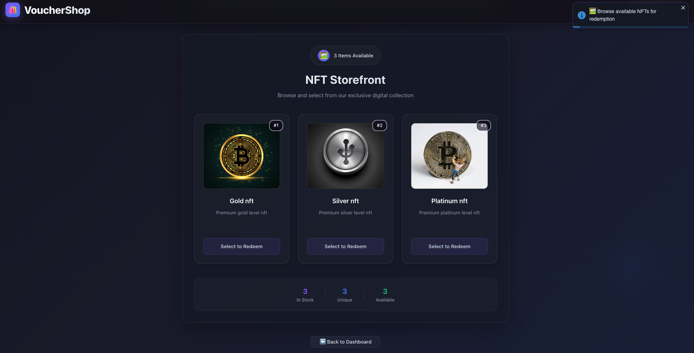

`Voucher Redemption Interface`

Redemption interface where users can redeem their vouchers for selected NFTs, with validation and celebration model celebratory feedback upon success.

- **Redeem Interface**

NFT redemption interface allowing users to select from available templates and redeem their vouchers.

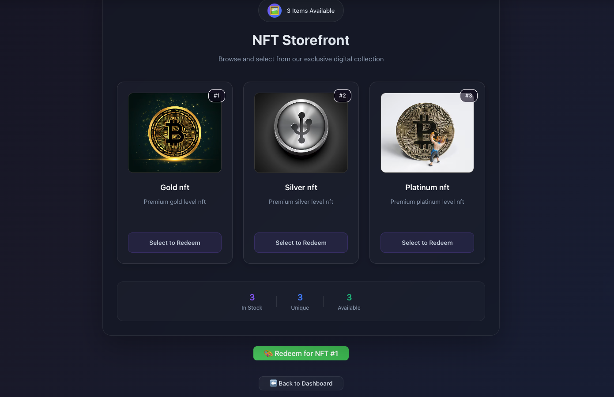

- **Validation Check Already - Redeemed**

Clear error state preventing duplicate redemptions with helpful guidance for users.

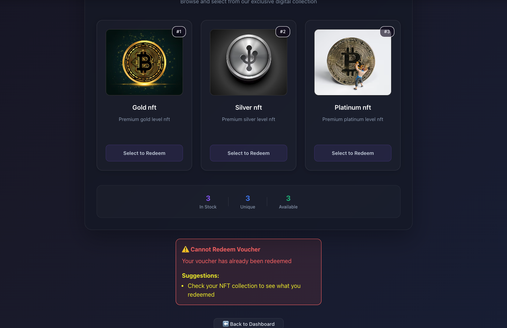

- **Redeem Success Celebration**

Celebration modal with confetti animation triggered upon successful NFT redemption.

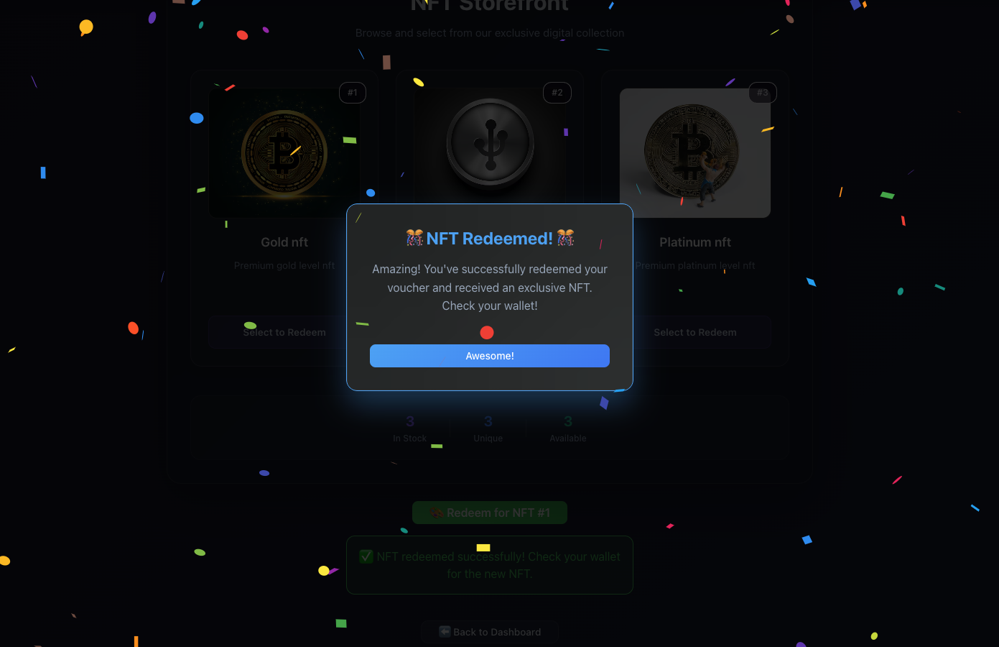

### `Redeem Voucher`
Users redeem their vouchers for exclusive NFT collectibles with minting and transfer. By using there claimed voucher, users can select an NFT template from the catalog and execute the redemption process (one coupon => one voucher).

`Move Package Code:`

```move reference
https://github.com/iota-community/workshops/tree/main/workshop-module-8/voucher_shop/sources/voucher_shop.move#L157-L201
```

- Validates catalog has available NFTs before redemption
- Checks voucher existence and usage status for the user
- Verifies selected NFT template exists in catalog
- Marks voucher as used BEFORE minting to prevent reentrancy
- Creates transferable `VoucherNFT` object with rich metadata
- Uses `transfer::public_transfer` for wallet-native NFT visibility
- Updates redemption history for user tracking
- Emits `NFTRedeemed` event for frontend celebration triggers

`Frontend User Interaction with IOTA dApp Kit:`

The redemption process showcases IOTA dApp Kit's comprehensive transaction handling with automatic effect reporting:

```javascript reference
https://github.com/iota-community/workshops/tree/main/workshop-module-8/vouchershop-frontend/src/hooks/useVoucherShop.ts#L244-L271
```

```javascript reference
https://github.com/iota-community/workshops/tree/main/workshop-module-8/vouchershop-frontend/src/hooks/useVoucherShop.ts#L107-L172
```

`NFT Storefront interface:`

```javascript reference
https://github.com/iota-community/workshops/tree/main/workshop-module-8/vouchershop-frontend/src/components/NFTStorefront.tsx#L1-L383
```

`Redemption Component with Celebration Integration:`

```javascript reference
https://github.com/iota-community/workshops/tree/main/workshop-module-8/vouchershop-frontend/src/components/RedeemVoucher.tsx#L1-L188
```

`Package Test Code:`

```move reference
https://github.com/iota-community/workshops/tree/main/workshop-module-8/voucher_shop/tests/voucher_shop_tests.move#L233-L489
```

## View Functions
View functions provide read-only access to contract state, enabling the frontend to display real-time data without transaction costs.

### `has_voucher` and `is_voucher_used`
Check user voucher status for UI state management.

`Move Package Code:`

```move reference
https://github.com/iota-community/workshops/tree/main/workshop-module-8/voucher_shop/sources/voucher_shop.move#L203-L208
```

```move reference
https://github.com/iota-community/workshops/tree/main/workshop-module-8/voucher_shop/sources/voucher_shop.move#L210-L215
```

### view_available_nfts

Retrieves all available NFT templates for storefront display.

`Move Package Code:`

```move reference
https://github.com/iota-community/workshops/tree/main/workshop-module-8/voucher_shop/sources/voucher_shop.move#L216-L230
```

### get_redemption_history

Gets user's redemption history for personal dashboard.

`Move Package Code:`

```move reference
https://github.com/iota-community/workshops/tree/main/workshop-module-8/voucher_shop/sources/voucher_shop.move#L231-L246
```

:::note

As already mentioned after complete implementation and deploying the Move package make sure to replace `<packageId>` and `<voucherShopObject>` with actual object IDs from your deployment in the `networkConfig.ts` file.

and Admin/publisher have to run the CLI commands mentioned in the `VoucherShop CLI Commands for Admin/Publisher` section to set up the VoucherShop contract and add initial NFT templates to the catalog.

:::


## Run Unit Tests

You can use the following command in the package root to run any unit tests you have created.

```shell
iota move test
```

## Publish the Package

[Publish](../getting-started/publish.mdx) the package to the IOTA Network using the following command:

```shell 
iota client publish
```

## Complete Source Code (Frontend and Move Package Contract + Tests)

### Frontend Application

**Source Code Repository:** [VoucherShop-frontend](https://github.com/iota-community/workshops/tree/main/workshop-module-8/vouchershop-frontend)

**Live Demo:** [VoucherShop dApp Frontend](https://vouchershop.vercel.app/)

### Move Smart Contract

**Contract Source Code:** [voucher_shop.move](https://github.com/iota-community/workshops/blob/main/workshop-module-8/voucher_shop/sources/voucher_shop.move)

**Contract Tests:** [voucher_shop_tests.move](https://github.com/iota-community/workshops/blob/main/workshop-module-8/voucher_shop/tests/voucher_shop_tests.move)


## Sequence Diagram

The sequence diagram illustrates the complete VoucherShop dApp flow demonstrating rapid dApp development using IOTA dApp Kit. The Admin deploys the smart contract using IOTA CLI commands and configures the frontend network settings. Users connect wallets seamlessly through the pre-built ConnectButton component, with dApp Kit automatically managing connection states. For core functionalities like voucher claims and NFT redemptions, the useSignAndExecuteTransaction hook handles all transaction complexity - from wallet signing to blockchain execution. The smart contract processes transactions and mints transferable NFTs directly to user wallets. This end-to-end flow showcases how IOTA dApp Kit enables rapid dApp development by abstracting blockchain complexities into simple components and hooks.

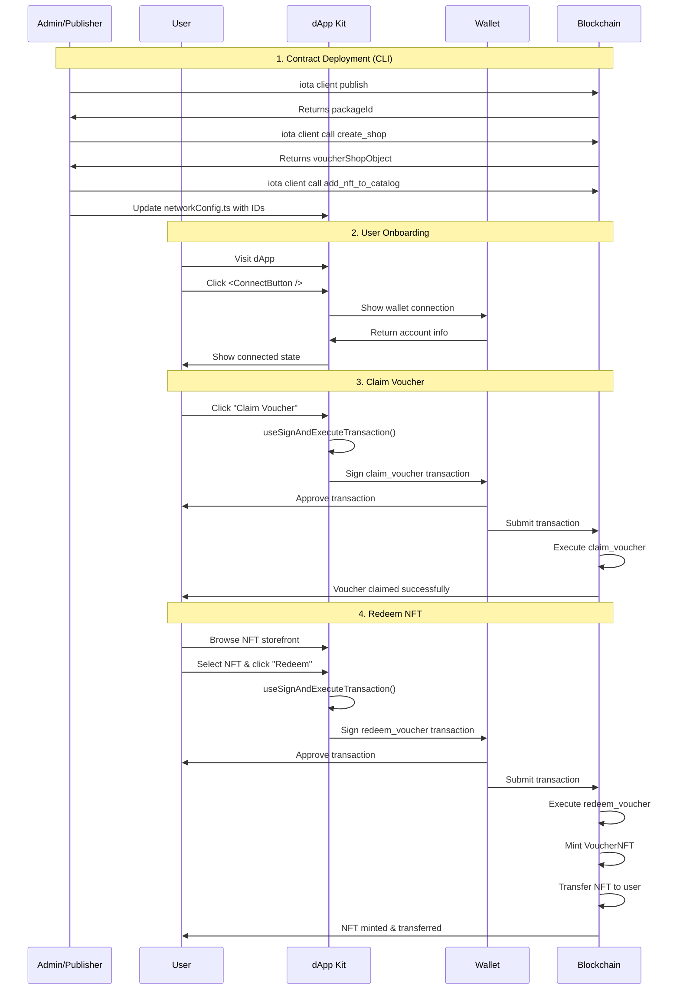

## Conclusion
The VoucherShop workshop demonstrates the revolutionary power of IOTA dApp Kit for rapid decentralized application development. By abstracting away the traditional complexities of blockchain integration - wallet connections, transaction signing, state management, and error handling - dApp Kit enables developers to build production-ready dApps in hours instead of weeks.

Key IOTA dApp Kit Benefits Showcased:

- Rapid Development: From zero to deployed dApp in record time
- Developer Experience: Intuitive hooks and components that just work
- Seamless Integration: Pre-built wallet support across the IOTA ecosystem
- Beautiful UIs: Professional components with custom theming
- Production Ready: Built-in error handling, loading states, and type safety

This workshop proves that blockchain development doesn't have to be complex. With IOTA dApp Kit, developers can focus on creating amazing user experiences rather than wrestling with blockchain infrastructure, truly democratizing access to Web3 development.

## Extension Tasks

### Build a Multi-Tenant Voucher Platform
Transform your VoucherShop into a platform where creators can launch their own branded voucher ecosystems. Create a factory contract that enables anyone to deploy custom voucher shops with unique NFT collections and redemption mechanics.

**Build These Advanced Features:**

- Multi-shop factory system for custom voucher ecosystem creation

- Dynamic NFT tiers with rarity systems and collection bonuses

- Cross-shop voucher compatibility for platform-wide engagement

- Creator analytics dashboard with real-time redemption metrics

### Technical Challenges:

- Factory contract patterns for voucher shop deployment
- Dynamic NFT metadata and tier systems
- Cross-contract voucher validation
- Multi-tenant economic balancing

**Need help or want to collaborate?** Join the [IOTA Builders Discord](https://discord.gg/iota-builders) to share progress, get feedback on economic models, and solve technical challenges with the community. Share your dApp progress and new ideas!