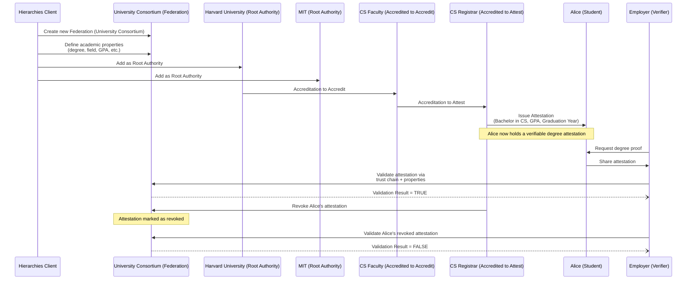
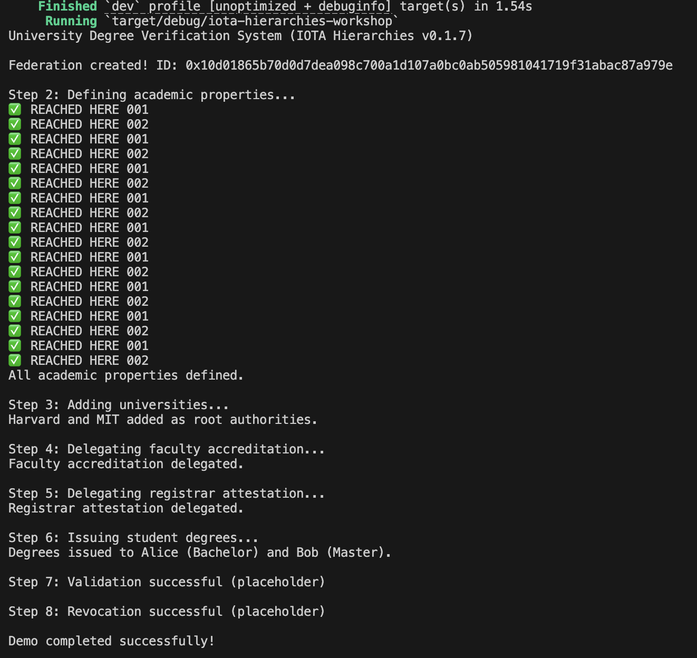

# IOTA Hierarchy Workshop

In this workshop, we will build a **University Degree Verification system** using **IOTA Hierarchies** and **Rust**. This workshop demonstrates a decentralized trust framework for a consortium of universities, where accreditations and attestations create a tamper-proof chain for issuing and verifying degrees.

## The Problem

Traditional degree verification is slow, costly, and prone to fraud. Universities issue paper or digital degrees that employers must verify through manual processes, often contacting institutions directly. This creates delays, administrative burdens, and risks of forged credentials. Centralized systems are vulnerable to tampering, and students lack control over their own credentials, relying on third parties for validation.

## The Opportunity

**IOTA Hierarchies** offers a decentralized solution for secure, instant degree verification. By using a trust chain (Consortium → University → Faculty → Registrar), universities can issue tamper-proof digital degrees. Employers can validate them directly on the IOTA network, reducing costs, eliminating fraud, and empowering students with portable, verifiable credentials.

## What You Will Build in This Workshop

You’ll create a full University Degree Verification system in Rust using IOTA Hierarchies. The system includes a consortium federation, trusted universities (e.g., Harvard), faculties, and registrars. You’ll issue digital degrees to students (e.g., Alice’s Bachelor in CS) and enable employers to validate them. You’ll also implement revocation, simulating real-world credential management, all anchored on the IOTA network.

## What You'll Learn
- Create a federation representing a university consortium.
- Define academic properties (e.g., degree type, field, GPA).
- Add root authorities (universities) to the federation.
- Delegate trust through accreditations (to accredit and to attest).
- Issue attestations as digital degrees.
- Validate attestations against the federation's trust chain.
- Revoke and reinstate degrees.

By the end, you'll have a complete system where universities delegate authority to faculties and registrars, issue verifiable degrees to students, and allow employers to validate them securely on the IOTA network.



## Business Context

Universities need a secure way to issue degrees that employers can verify without manual checks. With IOTA Hierarchies:

In this context of a Uinversity Degree Verification System:

- A **Federation** represents the consortium of universities.
- **Root Authorities** are trusted universities (e.g., Harvard, MIT).
- **Accreditations** delegate authority from universities to faculties and registrars.
- **Attestations** are the tamper-proof degrees issued to students.
- **Validation** allows employers to check authenticity via the trust chain.
- **Revocation** enables invalidating degrees if needed.

This creates a decentralized, efficient system reducing fraud and costs.

## Prerequisites

Before starting:

- Rust (v1.70+ recommended) and Cargo installed (Install Guide).
- A code editor like VS Code with Rust extensions (Install Guide).
- Basic knowledge of Rust and IOTA Identity concepts (DIDs, VCs, VPs).
- Set up a local IOTA network with Hierarchies contract deployed (Local Network Setup).
    - See [Local Network Setup](../../developer/iota-hierarchies/getting-started/local-network-setup.mdx)
    - Ensure you can request test tokens from the faucet.
- Environment variables (set in the next section).

## Understanding the Core Concepts Before We Code

Before diving into the code, let’s solidify our understanding of the fundamental building blocks of IOTA Hierarchies. These concepts form the foundation for building decentralized trust systems such as our university degree verification project.

### 1. Federation

Think of a Federation as the umbrella organization that defines the rules of trust for a specific domain — in our case, the University Consortium.

**What it is**:

- A federation is a decentralized trust framework that groups together multiple trusted parties (e.g., universities) under common governance.
- It sets the properties (like "degree", "field", "GPA") that can be issued, and it anchors root authorities (universities) who are recognized as trusted issuers.

**How it works**:

- A federation is created on IOTA and published publicly.
- It is the highest-level authority that others can reference for validation.
- Once established, the federation manages who can join and what claims can be issued.

In our project:

- The "University Consortium" is the federation that brings together Harvard, MIT, and other universities.
- This federation defines what counts as a valid academic credential.

### 2. Root Authority

Root Authorities are the trusted institutions at the top level of a federation.

**What it is**:

- An entity that the federation explicitly trusts to delegate power or issue claims.
- Typically large institutions such as accredited universities, government ministries, or professional licensing boards.

**How it works**:

- The federation adds an authority as a root authority.
- Once added, that authority can either issue claims directly or delegate responsibility to others.

In our project:

- Harvard and MIT are added as root authorities of the "University Consortium".
- This means both universities are recognized as legitimate sources of academic credentials.

### 3. Accreditation

**Accreditation** is the process of delegating trust down the hierarchy.

**What it is**:

- A **cryptographic proof** that one authority grants certain powers to another.
- Two main types:
    - **Accreditation to accredit**: grants the right to further delegate authority.
    - **Accreditation to attest**: grants the right to issue actual claims (attestations).

**How it works**:

- A university (root authority) can accredit a faculty.
- That faculty can then accredit a registrar.
- Each step is cryptographically recorded so the entire chain can be verified.

In our project:

- Harvard accredits its CS Faculty (to accredit).
- The CS Faculty accredits its Registrar (to attest).

### 4. Attestation

An attestation is the actual claim or credential issued to an individual.

**What it is**:

- A statement that an authority makes about a subject, bound by the federation’s rules.
- Examples: “Alice holds a Bachelor in Computer Science with GPA 3.7”, “Bob completed a Master in Biology”.

**How it works**:

- **Attestations** are cryptographically signed by an accredited authority.
- They are anchored into the federation so anyone can verify them against the root trust chain.

In our project:

- The Harvard CS Registrar issues an attestation to Alice: degree=bachelor, field=cs, gpa=3.7.
- Another attestation is issued to Bob: degree=master, field=cs, gpa=3.9.

### 5. Validation

**Validation** is the process of checking whether an attestation is trustworthy.

What it is:

- A check that confirms:
    - The attestation exists and hasn’t been revoked.
    - The issuer was properly accredited.
    - The chain of accreditations leads back to a federation root authority.

**How it works**:

- A **verifier** (e.g., an employer) queries the federation for the properties and checks the trust chain.
- If everything aligns, the claim is considered valid.

In our project:

- An employer validates Alice’s Bachelor’s degree by confirming the trust chain:
Consortium → Harvard → CS Faculty → Registrar → Attestation for Alice.

### 6. Revocation

Finally, credentials need to be revoked if they become invalid.

What it is:

- The process of invalidating an attestation or accreditation.
- Ensures that outdated or fraudulent credentials are no longer trusted.

How it works:

- A registrar or authority can revoke attestations they’ve issued.
- The federation ensures revocation is discoverable during validation.

In our project:

- If Alice’s degree was mistakenly issued, Harvard’s Registrar can revoke it.
- Validation checks after revocation will fail.

With these core concepts — Federation, Root Authority, Accreditation, Attestation, Validation, and Revocation — we can now clearly understand the trust model behind IOTA Hierarchies.
In the next section, we’ll implement these concepts step by step in Rust.

## Project Setup and Initialization

Let’s set up the Rust project and initialize the environment for the IOTA Hierarchies workshop.

1. Create a New Rust Project:

    - Open a terminal and create a new binary project:
    ```bash
    cargo new iota-hierarchies-workshop --bin
    cd iota-hierarchies-workshop
    ```
    - This creates a project with `Cargo.toml` and `src/main.rs`.

2. Add Dependencies:
    - Open `Cargo.toml` and add the following:

    ```bash
    [package]
    name = "iota-hierarchies-workshop"
    version = "0.1.0"
    edition = "2021"

    [dependencies]
    hierarchies = { git = "https://github.com/iotaledger/hierarchies", tag = "v0.1.7"}
    anyhow = "1.0"
    tokio = { version = "1", features = ["full"] }

    iota-sdk = { package = "iota-sdk", git = "https://github.com/iotaledger/iota.git", tag = "v1.12.0" }

    product_common = { git = "https://github.com/iotaledger/product-core.git", tag = "v0.8.7", features = ["core-client", "transaction", "test-utils"] }

    secret-storage = { git = "https://github.com/iotaledger/secret-storage", tag = "v0.3.0" }

    [patch.crates-io]
    iota-sdk = { git = "https://github.com/iotaledger/iota", tag = "v1.12.0" }
    ```
    - These include `anyhow` (error handling), `tokio` (async runtime), `iota-sdk` (IOTA network), `hierarchies` (core framework), and `product-common` (test utilities).

3. Set Environment Variables:

    - Set the required variables for the IOTA network and Hierarchies contract:
        - Command Prompt:
    ```cmd
    export API_ENDPOINT="http://127.0.0.1:9000"
    export IOTA_HIERARCHIES_PKG_ID="<your_deployed_hierarchies_package_id>"
    ```

    :::info
    See the [Local Network Setup and how to publish the IOTA Hierarchy package](../../developer/iota-hierarchies/getting-started/local-network-setup.mdx). Copy the package id and export it in your code.
    :::
    - Note: Replace `your_deployed_hierarchies_package_id` with the package ID from your local IOTA network’s Hierarchies contract deployment.
    - Verify variables:
        - PowerShell:

    ```PowerShell
    $env:API_ENDPOINT="http://127.0.0.1:9000"
    $env:IOTA_HIERARCHIES_PKG_ID="<your_deployed_hierarchies_package_id>"
    ```
    - Note: Replace `your_deployed_hierarchies_package_id` with the package ID from your local IOTA network’s Hierarchies contract deployment (see Local Network Setup).
    - Verify variables:
        - Command Prompt:
        ```bash
        echo $API_ENDPOINT
        echo $IOTA_HIERARCHIES_PKG_ID
        ```
        - PowerShell:

        ```PowerShell
        $env:API_ENDPOINT
        $env:IOTA_HIERARCHIES_PKG_ID
        ```

4. Test the Setup:
    - Run a build to ensure dependencies are downloaded:
    ```bash
    cargo build
    ```
    - If the build succeeds, your environment is ready.

### Step 1: Set Up Utilities

Create a `src/utils.rs` file to handle client setup. This helper abstracts connecting to the IOTA network and funding test accounts.

```rust
// src/utils.rs

// Copyright 2020-2025 IOTA Stiftung
// SPDX-License-Identifier: Apache-2.0

use anyhow::Context;
use hierarchies::client::{HierarchiesClient, HierarchiesClientReadOnly};
use iota_sdk::{IOTA_LOCAL_NETWORK_URL, IotaClientBuilder};

use product_common::test_utils::InMemSigner;
use product_common::test_utils::request_funds;

/// Create a read-only Hierarchies client.
/// This is useful for querying hierarchies without sending transactions.
pub async fn get_read_only_client() -> anyhow::Result<HierarchiesClientReadOnly> {
    let api_endpoint = std::env::var("API_ENDPOINT")
        .unwrap_or_else(|_| IOTA_LOCAL_NETWORK_URL.to_string());

    let iota_client = IotaClientBuilder::default()
        .build(&api_endpoint)
        .await
        .map_err(|err| anyhow::anyhow!(format!("failed to connect to network; {}", err)))?;

    let package_id = std::env::var("IOTA_HIERARCHIES_PKG_ID")
        .map_err(|e| {
            anyhow::anyhow!(
                "env variable IOTA_HIERARCHIES_PKG_ID must be set in order to run the examples"
            )
            .context(e)
        })
        .and_then(|pkg_str| pkg_str.parse().context("invalid package id"))?;

    HierarchiesClientReadOnly::new_with_pkg_id(iota_client, package_id)
        .await
        .context("failed to create a read-only HierarchiesClient")
}

/// Create a funded Hierarchies client with an in-memory signer.
/// This client can send transactions and manage attestations.
pub async fn get_funded_client() -> Result<HierarchiesClient<InMemSigner>, anyhow::Error> {
    let signer = InMemSigner::new();
    let sender_address = signer.get_address().await?;

    // Request faucet funds for testing
    request_funds(&sender_address).await?;

    let read_only_client = get_read_only_client().await?;
    let hierarchies_client: HierarchiesClient<InMemSigner> =
        HierarchiesClient::new(read_only_client, signer).await?;

    Ok(hierarchies_client)
}
```

**Explanation**:

- **What it does**: Defines two functions to create Hierarchies clients. `get_read_only_client` creates a client for querying the network without transactions. `get_funded_client` creates a funded client with signing capabilities for creating federations and issuing attestations.
- **Why it matters**: These utilities handle boilerplate like network connection, package ID retrieval, and test funding, keeping the main code focused on Hierarchies logic.
- **Key concepts**:
    - **HierarchiesClientReadOnly**: For read-only operations like validation.
    - **HierarchiesClient**: For write operations like creating federations or accreditations.
    - **InMemSigner**: An in-memory signer for test purposes, with `request_funds` to get faucet tokens.
In `main.rs`, import it with `use utils::get_funded_client;`.

### Step 2: Add IOTA Hierarchies Library Types Import

In `main.rs`, start by creating the imports.

```rust
use std::collections::{HashSet};

use hierarchies::client::HierarchiesClient;
use hierarchies::core::types::property::FederationProperty;
use hierarchies::core::types::property_name::PropertyName;
use hierarchies::core::types::property_shape::PropertyShape;
use hierarchies::core::types::property_value::PropertyValue;
use iota_sdk::types::base_types::IotaAddress;
use product_common::test_utils::InMemSigner;


mod utils;
use utils::get_funded_client;
```

**What it does**:

These imports bring in all the core types and utilities needed to interact with the IOTA Hierarchies library. They include the Hierarchies client, property-definition types, IOTA addresses, and an in-memory signer for test transactions. The final lines import the helper function for creating a funded client, from the utility file.

**Why it matters**:

This section is essential because it loads every building block your program needs to:

- connect to the IOTA blockchain,
- create federations,
- define academic properties,
- delegate accreditations,
- issue and revoke attestations.

The utilities abstract away low-level setup (like funding and signing), so the main logic stays clean and focused on the credential workflow.

**Key concepts**:

- **HierarchiesClient**:
    - Full read/write client used for creating federations, delegating authority, issuing and revoking attestations.
- **FederationProperty, PropertyName, PropertyShape, PropertyValue**:
    - Core schema components defining the structure, rules, and allowed values of credential properties.
- **IotaAddress**:
    - Represents identities participating in the federation (universities, faculty, registrar, students).
- **InMemSigner**:
    - Temporary in-memory signer for test transactions—no persistent keys needed.
    - Used with faucet funding so operations can be published on-chain.
- **get_funded_client (from utils module)**:
    - Creates a fully working Hierarchies client with funds and signing capability.
    - Imported into `main.rs` with:

### Step 3: Initialize the System and Create the Federation

```rust
#[tokio::main]
async fn main() -> anyhow::Result<()> {
    println!("University Degree Verification System (IOTA Hierarchies v0.1.7)\n");

    // Get a funded client with gas + signer
    let client = get_funded_client().await?;

    // Step 1: Create federation
    let federation = client
        .create_new_federation()
        .build_and_execute(&client)
        .await?
        .output;

    println!("Federation created! ID: {}\n", federation.id);

    define_academic_properties(&client, &federation).await?;
    add_universities(&client, &federation).await?;

    let harvard_cs_faculty = delegate_faculty_accreditation(&client, &federation).await?;
    let harvard_cs_registrar =
        delegate_registrar_attestation(&client, &federation, &harvard_cs_faculty).await?;

    issue_student_attestations(&client, &federation, &harvard_cs_registrar).await?;
    validate_credentials(&client, &federation).await?;
    revoke_attestation(&client, &federation).await?;

    println!("Demo completed successfully!\n");
    Ok(())
}
```

**Explanation**:

- Initializes the application.
- Creates a funded client using `get_funded_client()`, which gives us:
    - a signer (InMemSigner)
    - a connection to the selected IOTA network
    - enough gas to submit Hierarchies transactions
- Creates a brand-new federation on-chain.
- Calls each step of the academic verification workflow in order.

**Why it matters**:

A federation is the top-level governance structure in IOTA Hierarchies. All rules, authorities, and attestations are scoped within it.
Think of it as the “University Consortium” root organization from which permissions flow downward.

**Key concepts**:

- **Federation**: Top-level container that defines the trust network for all accreditations and attestations.
- **HierarchiesClient**: A Move-aware client for reading and writing to IOTA Hierarchies.
- **build_and_execute()**: Runs the on-chain transaction and returns the result.

### Step 4: Define Academic Properties in the Federation

Add properties that can be used in attestations (degrees).

```Rust
async fn define_academic_properties(
    client: &HierarchiesClient<InMemSigner>,
    federation: &hierarchies::core::types::Federation,
) -> anyhow::Result<()> {
    println!("Step 2: Defining academic properties...");

    let degree_bachelor = PropertyName::from("degree.bachelor");
    let degree_master = PropertyName::from("degree.master");
    let degree_phd = PropertyName::from("degree.phd");

    let field_cs = PropertyName::from("field.computer_science");
    let field_engineering = PropertyName::from("field.engineering");
    let field_mathematics = PropertyName::from("field.mathematics");

    let grade_gpa = PropertyName::from("grade.gpa");
    let graduation_year = PropertyName::from("graduation.year");
    let student_verified = PropertyName::from("student.verified");

    let degree_values = HashSet::from([
        PropertyValue::Text("completed".into()),
        PropertyValue::Text("in_progress".into()),
        PropertyValue::Text("withdrawn".into()),
    ]);

    let boolean_values = HashSet::from([
        PropertyValue::Text("true".into()),
        PropertyValue::Text("false".into()),
    ]);

    macro_rules! add {
        ($prop:expr) => {
            client
                .add_property(*federation.id.object_id(), $prop)
                .build_and_execute(client)
                .await?
        };
    }

    add!(FederationProperty::new(degree_bachelor.clone()).with_allowed_values(degree_values.clone()));
    add!(FederationProperty::new(degree_master.clone()).with_allowed_values(degree_values.clone()));
    add!(FederationProperty::new(degree_phd.clone()).with_allowed_values(degree_values));

    add!(FederationProperty::new(field_cs.clone()).with_allowed_values(boolean_values.clone()));
    add!(FederationProperty::new(field_engineering.clone()).with_allowed_values(boolean_values.clone()));
    add!(FederationProperty::new(field_mathematics.clone()).with_allowed_values(boolean_values.clone()));

    add!(FederationProperty::new(grade_gpa)
        .with_expression(PropertyShape::GreaterThan(200))
        .with_allowed_values(HashSet::from([
            PropertyValue::Number(200), PropertyValue::Number(250),
            PropertyValue::Number(300), PropertyValue::Number(320),
            PropertyValue::Number(350), PropertyValue::Number(380),
            PropertyValue::Number(400),
        ])));

    add!(FederationProperty::new(graduation_year)
        .with_expression(PropertyShape::GreaterThan(1950))
        .with_allowed_values(HashSet::from([
            PropertyValue::Number(2020), PropertyValue::Number(2021),
            PropertyValue::Number(2022), PropertyValue::Number(2023),
            PropertyValue::Number(2024), PropertyValue::Number(2025),
        ])));

    add!(FederationProperty::new(student_verified.clone())
        .with_allowed_values(boolean_values.clone()));

    println!("All academic properties defined.\n");
    Ok(())
}
```
**Explanation**:

**What it does:**

- This function defines all academic attributes that can appear in attestation certificates. These include:
- Degree types (degree.bachelor, degree.master, etc.).
- Academic fields (CS, Engineering, Mathematics).
- GPA values.
- Graduation year.
- A boolean “student.verified” indicator.

Each property is added to the federation using client.add_property.

**Why it matters**:

Properties define the schema and rules for all attestations issued under this federation.
Without properties, the federation cannot issue structured credentials.

**Key concepts:**

- FederationProperty: Defines a property name, allowed values, constraints, and rules.
- PropertyName: A namespaced string identifying the property.
- PropertyValue: Actual values allowed for attestations.
- PropertyShape: Rule-based validation (e.g., number > 200).

### Step 5: Add Universities to the Federation

Add trusted universities to the federation.

```rust
async fn add_universities(
    client: &HierarchiesClient<InMemSigner>,
    federation: &hierarchies::core::types::Federation,
) -> anyhow::Result<()> {
    println!("Step 3: Adding universities...");

    let harvard = IotaAddress::random_for_testing_only();
    let mit = IotaAddress::random_for_testing_only();

    client.add_root_authority(*federation.id.object_id(), harvard.into())
        .build_and_execute(client).await?;
    client.add_root_authority(*federation.id.object_id(), mit.into())
        .build_and_execute(client).await?;

    println!("Harvard and MIT added as root authorities.\n");
    Ok(())
}

```
Explanation:

- **What it does**:

This function adds two universities, Harvard and MIT as root authorities in the federation.

- We generate random IOTA addresses for Harvard and MIT (for demo/testing)
- We call add_root_authority on the federation twice
- Each university is now recognized as a trusted top-level authority in the federation

**Why it matters**

In IOTA Hierarchies:

- A root authority is a top-level trusted entity
- Only root authorities can:
    - Create delegations
    - Issue accreditations
    - Attest verified information about students

By adding Harvard and MIT as root authorities, we are establishing them as official trusted universities in our academic system.

This forms the foundation for all later steps:

- Faculties will be accredited under these universities
- Registrars will issue attestations on behalf of these universities
- Students will receive degrees that are cryptographically linked back to these root authorities

**Key Concepts**
**Root Authority**

- Has top-level power
- Appears directly under the federation
- Can delegate authority to departments, registrars, or faculty

### Step 6: Delegate Faculty Accreditation

Delegate accreditation rights from universities to faculties.

```rust
async fn delegate_faculty_accreditation(
    client: &HierarchiesClient<InMemSigner>,
    federation: &hierarchies::core::types::Federation,
) -> anyhow::Result<IotaAddress> {
    println!("Step 4: Delegating faculty accreditation...");
    let faculty = IotaAddress::random_for_testing_only();

    client.create_accreditation_to_accredit(*federation.id.object_id(), faculty.into(), vec![])
        .build_and_execute(client).await?;

    println!("Faculty accreditation delegated.\n");
    Ok(faculty)
}
```

**Explanation**:

**What it does**

This step grants a faculty address the permission to further accredit others.

- A new IOTA address (representing a faculty member or department) is created
- create_accreditation_to_accredit gives this address the ability to accredit entities beneath it
- This models a real-world scenario where a university delegates accreditation responsibility to its faculty

**Why it matters**

Root authorities (universities) may not want to manage all accreditations directly.

Delegating accreditation to a faculty:

- Mirrors how universities operate
- Allows hierarchical trust models
- Prepares the faculty to later authorize registrars or departments

Without this delegation, registrars cannot be created, and degrees cannot be issued.

**Key Concepts**
**Accreditation**
Authorization that allows an entity to create additional sub-entities.

**Accredit vs Attest**

- Accredit = grant permissions
- Attest = issue verifiable facts (e.g., degrees)

**Empty** vec![]
Means we are not restricting the faculty to certain properties yet.

### Step 7: Delegate Registrar Attestation

Faculties grant attestation rights to registrars.

```rust
async fn delegate_registrar_attestation(
    client: &HierarchiesClient<InMemSigner>,
    federation: &hierarchies::core::types::Federation,
    _faculty: &IotaAddress,
) -> anyhow::Result<IotaAddress> {
    println!("Step 5: Delegating registrar attestation...");
    let registrar = IotaAddress::random_for_testing_only();

    client.create_accreditation_to_attest(*federation.id.object_id(), registrar.into(), vec![])
        .build_and_execute(client).await?;

    println!("Registrar attestation delegated.\n");
    Ok(registrar)
}
```

**Explanation:**

**What it does**

This creates a registrar and authorizes it to attest student information.

- Generates a registrar IOTA address
- Uses create_accreditation_to_attest
- Registrar now has the right to issue official academic attestations (e.g., "Bachelor completed")

**Why it matters**

Registrars represent administrative bodies that:

- Approve student graduations
- Issue diplomas
- Update academic records

Without a registrar with attestation rights, no degrees can be issued.

**Key Concepts**
**Attestation**

A signed, verifiable piece of information.
Examples:
- “Alice completed Bachelor in CS”
- “Bob graduated in 2025”

**Registrar Role**
Responsible for recording validated facts within the federation.

### Step 8: Issue Degrees (Create Student Attestations)

Registrars issue degrees as attestations.

```rust
async fn issue_student_attestations(
    client: &HierarchiesClient<InMemSigner>,
    federation: &hierarchies::core::types::Federation,
    _registrar: &IotaAddress,
) -> anyhow::Result<()> {
    println!("Step 6: Issuing student degrees...");
    let alice = IotaAddress::random_for_testing_only();
    let bob = IotaAddress::random_for_testing_only();

    client.create_accreditation_to_attest(
        *federation.id.object_id(),
        alice.into(),
        vec![FederationProperty::new(PropertyName::from("degree.bachelor"))
            .with_allowed_values(HashSet::from([PropertyValue::Text("completed".into())]))],
    ).build_and_execute(client).await?;

    client.create_accreditation_to_attest(
        *federation.id.object_id(),
        bob.into(),
        vec![FederationProperty::new(PropertyName::from("degree.master"))
            .with_allowed_values(HashSet::from([PropertyValue::Text("completed".into())]))],
    ).build_and_execute(client).await?;

    println!("Degrees issued to Alice (Bachelor) and Bob (Master).\n");
    Ok(())
}
```

**Explanation:**

**What it does**

This step issues actual degrees to students:

- Creates student addresses (Alice & Bob)
- Attaches academic properties (degree.bachelor, degree.master)
- Marks their degree as "completed" using a PropertyValue

**Why it matters**

This simulates the core outcome of the entire system:

:::note
A university registrar issuing verifiable cryptographic degrees to students.
:::

These attestations:

- Are stored in the federation hierarchy
- Can be looked up by employers or verifiers
- Cannot be forged because all signatures are cryptographically validated

This is where Hierarchies becomes a real credentialing system.

**Key Concepts**
**FederationProperty**

Defines the property attached to the attestation:

- property name (e.g., degree.bachelor)
- allowed values (e.g., "completed")

**Attesting a student**

Means the registrar publishes a verifiable academic record for that student.

### Step 9: Validate Credentials (Placeholder)

Validate a student's degree.

```rust
async fn validate_credentials(
    _client: &HierarchiesClient<InMemSigner>,
    _federation: &hierarchies::core::types::Federation,
) -> anyhow::Result<()> {
    println!("Step 7: Validation successful (placeholder)\n");
    Ok(())
}
```

**Explanation:**

**What it does**

Currently a placeholder, but in a full version this step will:

- Query issued attestations
- Validate degree status
- Confirm signatures and trust chain
- Check if registrar authorization was valid

This is where employers or institutions verify credentials.


**Why it matters**

Credential validation is essential for:

- Hiring processes
- Academic transfers
- Scholarship or visa applications

Hierarchies ensures trust by automatically verifying the chain:

**Federation → University → Registrar → Student Credential**

**Key Concepts**
**End-to-end verification**

Ensures that:

- The attestation belongs to the student
- It was issued by an accredited registrar
- Registrar belongs to a legitimate university
- University is registered under the federation

### Step 10: Revoke Attestation (Placeholder)

Revoke an attestation.

```rust
async fn revoke_attestation(
    _client: &HierarchiesClient<InMemSigner>,
    _federation: &hierarchies::core::types::Federation,
) -> anyhow::Result<()> {
    println!("Step 8: Revocation successful (placeholder)\n");
    Ok(())
}
```

**Explanation:**

**What it does**

Another placeholder, this will handle revoking student credentials.

**Examples**:

- Fraudulent submissions
- Degree revoked
- Administrative correction

**Why it matters**

Real academic systems need revocation mechanisms.

## Running the Workshop

Compile and run:

```bash
cargo run
```

**Expected output**:



## Next Steps

- Explore revocation reinstatement.
- Integrate with a frontend for UI-based verification.