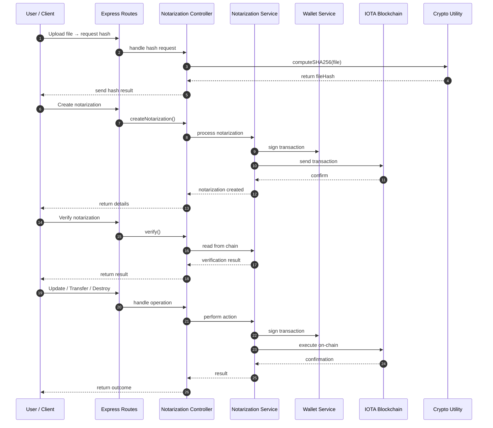

# Implementing Proof of Integrity and Auditability with IOTA Notarization

## Overview

This workshop tutorial guides you through implementing blockchain-based document notarization using IOTA's Notarization framework. You'll learn how to create immutable proof of document existence, build audit trails for regulatory compliance, and verify document integrity using both dynamic (mutable) and locked (immutable) notarization strategies.

Objective: Apply notarization patterns for audit trails, document authenticity, and state verification using dynamic/locked and static strategies on the IOTA ledger.

**Use Cases**:
- Prove that a document or dataset existed at a certain time and wasn't altered
- Log regulatory filings or records with cryptographic proof of authenticity
- Generate public audit trails for decisions, votes, or contract updates

## Prerequisites
To complete this workshop, ensure you have the following prerequisites:
- [Node.js](https://nodejs.org/en) >= v22.14.0
- [npx](https://www.npmjs.com/package/npx) >= 11.4.2
- [iota CLI](https://github.com/iotaledger/iota/releases) >= 1.5.0
- Basic knowledge of TypeScript and REST APIs
- Familiarity with blockchain concepts

## Architecture Overview

The IOTA Notarization system provides two main types of notarizations:

**Dynamic Notarizations:**

- Mutable - content and metadata can be updated

- Transferable between wallets (with optional locks)

- Tracks version history with timestamps

- Ideal for evolving documents like contracts, compliance records

**Locked Notarizations:**

- Immutable - cannot be modified or transferred

- Permanent blockchain record

- Optional time-based delete locks

- Perfect for legal documents, certificates, final records

Both types store SHA-256 hashes of your content on-chain, providing cryptographic proof of existence and integrity.

## Set up Development Environment and Publish the IOTA Notarization Package

### Step 1: Set Up the IOTA Network

First, configure your [IOTA client for the desired network](../getting-started/connect.mdx). We'll use testnet for this tutorial, but the same process applies to devnet or localnet.

**Check Available Environments**: 

```bash
iota client envs
```

**Switch to Testnet**:

```bash
iota client switch --env testnet(or your desired network)
```

**Check Your Wallet Addresses**:

```bash
iota client addresses
```

:::note

You will be publishing notarizations package from this address, so ensure you have access to its private key(Better to use the address to which you have browser iota wallet setup).

:::

**Request Test Funds**:

```bash
iota client faucet
```

### Step 2: Publish the IOTA Notarization Package

Now we'll deploy the Notarization smart contract package to the testnet.

:::note 

For your reference do visit the [notarization documentation](https://docs.iota.org/developer/iota-notarization/getting-started/local-network-setup) for more details and set up.

:::

**Clone the IOTA Notarization Repository**

```bash
git clone https://github.com/iotaledger/notarization.git
cd notarization
```

**Switch to Stable Version**

Check the releases and switch to the latest stable tag:

```bash
git checkout v0.1.6  # Use the latest stable version
```

**Publish the Package**

```bash
./notarization-move/scripts/publish_package.sh
```

The last line of output will display your package ID. Save this for later:

```text
Package ID: 0xc953.....
```

### Verify Package on Explorer

Open the IOTA Explorer to verify your package deployment:

```text
https://explorer.iota.org/object/<your-package-id>?network=testnet
```

### Step 3: Set Up the Backend Service

Now let's set up the Node.js backend service that will interact with our deployed notarization package.

**Create Project Structure**

```bash
mkdir iota-notarization-backend
cd iota-notarization-backend
```

**Initialize Project**

```bash
npm init -y
```

**Install Dependencies**

```bash
npm install @iota/iota-sdk @iota/notarization @noble/ed25519 bech32 cors dotenv express multer
npm install -D @types/cors @types/express @types/multer @types/node nodemon ts-node typescript
```

**Create Project Structure**

```bash
mkdir -p src/controllers src/routes src/services src/utils
```

**File/Folder structure**

```text
.
├── Api-docs.md
├── package-lock.json
├── package.json
├── pnpm-lock.yaml
├── Readme.md
├── src
│   ├── controllers
│   │   └── notarizationController.ts
│   ├── routes
│   │   └── notarizationRoutes.ts
│   ├── server.ts
│   ├── services
│   │   ├── notarizationService.ts
│   │   └── walletService.ts
│   └── utils
│       └── crypto.ts
└── tsconfig.json
```

**Configure TypeScript**

Create `tsconfig.json`:

```json
{
  "compilerOptions": {
    "target": "ES2020",
    "module": "commonjs",
    "lib": ["ES2020"],
    "outDir": "./dist",
    "rootDir": "./src",
    "strict": true,
    "esModuleInterop": true,
    "skipLibCheck": true,
    "forceConsistentCasingInFileNames": true,
    "resolveJsonModule": true
  },
  "include": ["src/**/*"],
  "exclude": ["node_modules", "dist"]
}
```

**Environment Configuration**:

Create `.env` file:

```text
# IOTA Configuration
IOTA_NOTARIZATION_PKG_ID=
NETWORK_URL=
# Wallet Configuration (Generate one or use existing) IOTA wallet private key
PRIVATE_KEY=
# Server Configuration
PORT=3001
```

**Package Configuration**:

Update `package.json` with scripts:

```json
{
  "name": "iota-notarization-backend",
  "version": "1.0.0",
  "description": "",
  "main": "dist/server.js",
  "scripts": {
    "dev": "nodemon src/server.ts",
    "build": "tsc",
    "start": "node dist/server.js",
    "test": "echo \"Run tests with Postman\" && exit 0"
  },
  "keywords": [],
  "author": "",
  "license": "ISC",
  "type": "commonjs",
  "dependencies": {
    "@iota/iota-sdk": "^1.6.1",
    "@iota/notarization": "^0.1.6",
    "@noble/ed25519": "^3.0.0",
    "bech32": "^2.0.0",
    "cors": "^2.8.5",
    "dotenv": "^17.2.3",
    "express": "^5.1.0",
    "multer": "^2.0.2"
  },
  "devDependencies": {
    "@types/cors": "^2.8.19",
    "@types/express": "^5.0.3",
    "@types/multer": "^2.0.0",
    "@types/node": "^24.6.2",
    "nodemon": "^3.1.10",
    "ts-node": "^10.9.2",
    "typescript": "^5.9.3"
  }
}
```

## Let's Implement Core Services

### Crypto Utilities - File Hashing Foundation

**What We're Building:** Cryptographic utilities for generating and validating SHA-256 hashes.

**Why We Need This:**

- Documents are stored on blockchain as cryptographic hashes, not the actual content
- SHA-256 creates unique digital fingerprints that are impossible to reverse-engineer
- We need to validate hash formats before sending to blockchain to prevent errors

**Postman collection for testing the API endpoints**

**Testing File Hash Generation Endpoint**

The file upload API endpoint in Postman showing how a document is processed before notarization — the response returns the generated SHA-256 hash and associated file metadata, ready to be registered on-chain.


**Implementation**- Create [src/utils/crypto.ts](https://github.com/iota-community/workshops/blob/main/workshop-module-12/iota-notarization-backend/src/utils/crypto.ts):

```javascript reference
https://github.com/iota-community/workshops/blob/197bc63488c014c23ef0bf5109bf73453ded591b/workshop-module-12/iota-notarization-backend/src/utils/crypto.ts#L1-L32
```

**Outcome:**
-  Cryptographic hash generation for document fingerprinting
-  File upload support with buffer processing
-  Hash format validation to prevent blockchain errors
-  Foundation for document integrity verification

### Wallet Service - Blockchain Connection Layer

**What We're Building:** Secure wallet management and blockchain connectivity.

**Why We Need This:**

- All blockchain operations require a wallet for signing transactions
- We need to handle private keys securely in multiple formats
- Automatic testnet faucet integration for development
- IOTA client initialization for blockchain interactions

**Implementation**- Create [src/services/walletService.ts](https://github.com/iota-community/workshops/blob/main/workshop-module-12/iota-notarization-backend/src/services/walletService.ts):

```javascript reference
https://github.com/iota-community/workshops/blob/197bc63488c014c23ef0bf5109bf73453ded591b/workshop-module-12/iota-notarization-backend/src/services/walletService.ts#L1-L161
```

**Outcome:**
-  Secure private key management with multiple format support
-  Automatic wallet generation with clear security instructions
-  Testnet faucet integration for development
-  IOTA client initialization for blockchain connectivity
-  Balance monitoring and fund management

## Notarization Service - Core Business Logic

### Notarization Client Initialization

**What We're Building:** Connection to IOTA Notarization smart contract.

**Why We Need This:**

- We need to initialize clients to interact with our deployed notarization package
- Both read-only and writable clients are required for different operations
- Package ID from environment variables connects us to our specific contract

**Postman collection for testing the API endpoints**

**Testing Health Check Endpoint**

A successful service health-check call that verifies the notarization service is running correctly, displaying API status, backend connectivity, and confirmation that all network components are operational.


**Implementation**- Add to [src/services/notarizationService.ts](https://github.com/iota-community/workshops/blob/main/workshop-module-12/iota-notarization-backend/src/services/notarizationService.ts):

```javascript reference
https://github.com/iota-community/workshops/blob/197bc63488c014c23ef0bf5109bf73453ded591b/workshop-module-12/iota-notarization-backend/src/services/notarizationService.ts#L1-L55
```

**Outcome:**
-  Connection to deployed notarization smart contract
-  Both read and write clients initialized
-  Lazy initialization to optimize performance
-  Proper error handling for missing configurations


### Dynamic Notarization Creation

**What We're Building:** Mutable notarizations that can be updated and transferred.

**Why We Need This:**

- Many documents evolve over time (contracts, compliance records, project docs)
- Users need to update content while maintaining audit trail
- Transfer capabilities allow ownership changes
- Time-based locks provide security controls

**Postman collection for testing the API endpoints**

**Testing Dynamic Notarization Creation Endpoint**

Creating a dynamic notarization with a transfer lock set to unlock at a future timestamp — demonstrating how time-based restrictions can be applied to prevent unauthorized transfers until the specified date.


Example of creating a dynamic notarization without any transfer or time locks — illustrating a fully flexible notarization that can later be updated or transferred by the owner without restriction.


**Implementation**- Add to [src/services/notarizationService.ts](https://github.com/iota-community/workshops/blob/main/workshop-module-12/iota-notarization-backend/src/services/notarizationService.ts):

```javascript reference
https://github.com/iota-community/workshops/blob/197bc63488c014c23ef0bf5109bf73453ded591b/workshop-module-12/iota-notarization-backend/src/services/notarizationService.ts#L57-L86
```

**Outcome:**
-  Mutable notarizations for evolving documents
-  Optional transfer locks for security
-  Immutable descriptions for permanent context
-  Blockchain transaction with proof of creation

### Locked Notarization Creation

**What We're Building:** Immutable notarizations for permanent records.

**Why We Need This:**

- Legal documents, certificates, and final records should never change
- Provides cryptographic proof of existence at a specific time
- Delete locks prevent accidental or malicious destruction
- Perfect for regulatory compliance and audit trails

**Postman collection for testing the API endpoints**

**Testing Locked Notarization Creation Endpoint**

Successful creation of a locked notarization with a delete lock set far in the future — ensuring the document remains permanently preserved on the blockchain until the unlock timestamp.


Error response when attempting to create a locked notarization with an invalid timestamp — demonstrating the system's validation that prevents setting delete locks in the past.


**Implementation**- Add to src/services/notarizationService.ts:

```javascript reference
https://github.com/iota-community/workshops/blob/197bc63488c014c23ef0bf5109bf73453ded591b/workshop-module-12/iota-notarization-backend/src/services/notarizationService.ts#L87-L126
```

**Outcome:**
-  Immutable records for permanent audit trails
-  Time-based delete locks for document protection
-  Cryptographic proof of document existence
-  Regulatory compliance ready

### State and Metadata Updates

**What We're Building:** Update capabilities for dynamic notarizations.

**Why We Need This:**

- Documents evolve - contracts get amended, records get updated
- Version tracking provides audit trail of changes
- Separate metadata updates don't affect content versioning
- Only dynamic notarizations should be updatable

**Postman collection for testing the API endpoints**

**Testing State and Metadata Update Endpoint**

Updating the content hash and metadata of a dynamic notarization — showing how document versions evolve while maintaining a complete audit trail of changes on the blockchain.


Modifying only the metadata of a dynamic notarization without changing the content hash — demonstrating how administrative information can be updated independently from the core document content.


**Implementation**- Add to [src/services/notarizationService.ts](https://github.com/iota-community/workshops/blob/main/workshop-module-12/iota-notarization-backend/src/services/notarizationService.ts):

```javascript reference
https://github.com/iota-community/workshops/blob/197bc63488c014c23ef0bf5109bf73453ded591b/workshop-module-12/iota-notarization-backend/src/services/notarizationService.ts#L128-L168
```

**Outcome:**
-  Version tracking for document evolution
-  Separate content and metadata update paths
-  Immutability protection for locked notarizations
-  Complete audit trail of changes

### Notarization Ownership Transfer

**What We're Building:** Transfer dynamic notarizations between wallets.

**Why We're Building This:**

- Document ownership may need to change hands
- Business processes often involve transferring responsibilities
- Only dynamic notarizations should be transferable
- Transfer locks can prevent unauthorized transfers

**Postman collection for testing the API endpoints**

**Testing Notarization Ownership Transfer Endpoint**

Successful transfer of a dynamic notarization to another wallet address — confirming that ownership changes are properly recorded on the blockchain with transaction verification.


Failed transfer attempt due to an active time lock — demonstrating how transfer restrictions protect documents from being moved before the specified unlock time.


Error when attempting to transfer a locked notarization — showing the system's protection against transferring immutable records that are designed to be permanently owned.


**Implementation**- Add to [src/services/notarizationService.ts](https://github.com/iota-community/workshops/blob/main/workshop-module-12/iota-notarization-backend/src/services/notarizationService.ts):

```javascript reference
https://github.com/iota-community/workshops/blob/197bc63488c014c23ef0bf5109bf73453ded591b/workshop-module-12/iota-notarization-backend/src/services/notarizationService.ts#L169-L188
```

**Outcome:**
-  Secure ownership transfer for dynamic notarizations
-  Protection against transferring locked notarizations
-  Blockchain-verified ownership changes
-  Support for business process workflows

### Notarization Destruction

**What We're Building:** Safe deletion of notarizations with lock checks.

**Why We Need This:**

- Storage cleanup when documents are no longer needed
- Delete locks prevent premature destruction
- Recovery of blockchain storage deposits
- Compliance with data retention policies

**Postman collection for testing the API endpoints**

**Testing Notarization Destruction Endpoint**

Successful deletion of a notarization that has no active locks — demonstrating proper cleanup and storage recovery when documents are no longer required.


Failed deletion attempt because the notarization has already been transferred to another owner — showing the system's protection against unauthorized destruction by non-owners.


Error when attempting to delete a locked notarization with an active delete lock — illustrating how time-based protection prevents premature document destruction.


**Implementation**- Add to [src/services/notarizationService.ts](https://github.com/iota-community/workshops/blob/main/workshop-module-12/iota-notarization-backend/src/services/notarizationService.ts):

```javascript reference
https://github.com/iota-community/workshops/blob/197bc63488c014c23ef0bf5109bf73453ded591b/workshop-module-12/iota-notarization-backend/src/services/notarizationService.ts#L189-L214
```

**Outcome:**
-  Safe deletion with lock validation
-  Protection against accidental data loss
-  Storage deposit recovery
-  Compliance with retention policies

### Query and Verification

**What We're Building:** Read operations and integrity verification.

**Why We Need This:**

- Users need to retrieve notarization details
- Integrity verification proves documents haven't been altered
- Version history provides audit trails
- Lock status informs users about available actions

**Postman collection for testing the API endpoints**

**Testing Notarization Query and Verification Endpoint**

**Notarization Details Retrieval**

Retrieving complete details of a dynamic notarization — showing version history, current content hash, metadata, and lock status information for comprehensive document auditing.


Viewing details of a locked notarization — displaying immutable properties, creation timestamp, and permanent lock status that distinguishes it from dynamic records.


**Cryptographic Integrity Verification**

Successful verification confirming that a document's current hash matches the expected value — providing cryptographic proof that the document hasn't been tampered with since notarization.


Failed verification showing hash mismatch — alerting users when a document's content doesn't match the blockchain record, indicating potential tampering or version issues.


**Implementation**- Add to [src/services/notarizationService.ts](https://github.com/iota-community/workshops/blob/main/workshop-module-12/iota-notarization-backend/src/services/notarizationService.ts):

```javascript reference
https://github.com/iota-community/workshops/blob/197bc63488c014c23ef0bf5109bf73453ded591b/workshop-module-12/iota-notarization-backend/src/services/notarizationService.ts#L215-L283
```

**Outcome:**
-  Complete notarization information retrieval
-  Cryptographic integrity verification
-  Version history and audit trail access
-  Lock status monitoring for user guidance

### System Health and Wallet Info

**What We're Building:** System monitoring and wallet information endpoints.

**Why We Need This:**

- Monitoring service health and connectivity
- Wallet balance and address information
- Network configuration verification
- Debugging and operational support

**Postman collection for testing the API endpoints**

**Testing Wallet Info Endpoint**

Wallet information endpoint displaying the connected IOTA address, current balance, and network status — essential for operational monitoring and debugging blockchain connectivity.


**Implementation**- Add to [src/services/notarizationService.ts](https://github.com/iota-community/workshops/blob/main/workshop-module-12/iota-notarization-backend/src/services/notarizationService.ts):

```javascript reference
https://github.com/iota-community/workshops/blob/197bc63488c014c23ef0bf5109bf73453ded591b/workshop-module-12/iota-notarization-backend/src/services/notarizationService.ts#L284-L321
```

**Outcome:**
-  System health monitoring
-  Wallet information and balance tracking
-  Network connectivity verification
-  Operational debugging support

## Controllers

API Controllers - HTTP Interface Layer

### File Hash Generation Endpoint

**What We're Building:** REST API endpoint for file hashing.

**Why We Need This:**

- Users need to generate hashes before notarization
- File upload support for easy document processing
- Hash validation before blockchain operations
- User-friendly interface for document preparation

**Implementation**- Create [src/controllers/notarizationController.ts](https://github.com/iota-community/workshops/blob/197bc63488c014c23ef0bf5109bf73453ded591b/workshop-module-12/iota-notarization-backend/src/controllers/notarizationController.ts#L1-L34):

```javascript reference
https://github.com/iota-community/workshops/blob/197bc63488c014c23ef0bf5109bf73453ded591b/workshop-module-12/iota-notarization-backend/src/controllers/notarizationController.ts#L1-L34
```

**Outcome:**
-  File upload and hash generation
-  User-friendly document preparation
-  Hash validation before blockchain operations
-  Error handling for file processing

### Dynamic Notarization Creation Endpoint

**What We're Building:** API endpoint for creating mutable notarizations.

**Why We Need This:**

- REST interface for dynamic notarization creation
- Input validation for required fields
- Transfer lock configuration support
- User feedback with transaction details

**Implementation**- Add to [src/controllers/notarizationController.ts](https://github.com/iota-community/workshops/blob/main/workshop-module-12/iota-notarization-backend/src/controllers/notarizationController.ts):

```javascript reference
https://github.com/iota-community/workshops/blob/197bc63488c014c23ef0bf5109bf73453ded591b/workshop-module-12/iota-notarization-backend/src/controllers/notarizationController.ts#L35-L74
```

**Outcome:**
-  REST API for dynamic notarization creation
-  Input validation and error handling
-  Transfer lock configuration support
-  Transaction confirmation with IDs

### Locked Notarization Creation Endpoint

**What We're Building:** API endpoint for creating immutable notarizations.

Why We Need This:

- REST interface for permanent record creation
- Delete lock configuration for document protection
- Input validation for hash formats
- Immutable description support

**Implementation**- Add to [src/controllers/notarizationController.ts](https://github.com/iota-community/workshops/blob/main/workshop-module-12/iota-notarization-backend/src/controllers/notarizationController.ts):

```javascript reference
https://github.com/iota-community/workshops/blob/197bc63488c014c23ef0bf5109bf73453ded591b/workshop-module-12/iota-notarization-backend/src/controllers/notarizationController.ts#L75-L114
```

**Outcome:**
-  REST API for immutable notarization creation
-  Delete lock configuration for security
-  Input validation for data integrity
-  Permanent record creation with proof

### Update Operations Endpoints

**What We're Building:** API endpoints for updating dynamic notarizations.

**Why We Need This:**

- Separate endpoints for state and metadata updates
- Parameter validation for notarization IDs
- Hash format validation for content updates
- Error handling for locked notarizations

**Implementation**- Add to [src/controllers/notarizationController.ts](https://github.com/iota-community/workshops/blob/main/workshop-module-12/iota-notarization-backend/src/controllers/notarizationController.ts):

```javascript reference
https://github.com/iota-community/workshops/blob/197bc63488c014c23ef0bf5109bf73453ded591b/workshop-module-12/iota-notarization-backend/src/controllers/notarizationController.ts#L115-L186
```
**Outcome:**
-  Separate update endpoints for flexibility
-  Parameter validation and error handling
-  Content hash validation
-  Protection against updating locked notarizations

### Transfer and Destruction Endpoints

**What We're Building:** API endpoints for ownership transfer and deletion.

**Why We Need This:**

- Ownership transfer for business processes
- Safe deletion with validation
- Recipient address validation
- Protection against unauthorized operations

**Implementation**- Add to [src/controllers/notarizationController.ts](https://github.com/iota-community/workshops/blob/main/workshop-module-12/iota-notarization-backend/src/controllers/notarizationController.ts):

```javascript reference
https://github.com/iota-community/workshops/blob/197bc63488c014c23ef0bf5109bf73453ded591b/workshop-module-12/iota-notarization-backend/src/controllers/notarizationController.ts#L188-L249
``` 

**Outcome:**
-  Secure ownership transfer operations
-  Safe deletion with validation checks
-  Parameter validation for all operations
-  Protection against invalid operations

### Query and Verification Endpoints

**What We're Building:** API endpoints for reading and verifying notarizations.

**Why We Need This:**

- Retrieve notarization details for users
- Cryptographic verification of document integrity
- Version history and lock status information
- User-friendly data presentation

**Implementation**- Add to [src/controllers/notarizationController.ts](https://github.com/iota-community/workshops/blob/main/workshop-module-12/iota-notarization-backend/src/controllers/notarizationController.ts):

```javascript reference
https://github.com/iota-community/workshops/blob/197bc63488c014c23ef0bf5109bf73453ded591b/workshop-module-12/iota-notarization-backend/src/controllers/notarizationController.ts#L251-L318
```

**Outcome:**
-  Complete notarization information retrieval
-  Cryptographic integrity verification
-  User-friendly data presentation
-  Error handling for missing notarizations

### System Endpoints

**What We're Building:** Health check and wallet information endpoints.

**Why We Need This:**

- Service health monitoring
- Wallet information for debugging
- Network connectivity verification
- Operational support endpoints

**Implementation**- Add to [src/controllers/notarizationController.ts](https://github.com/iota-community/workshops/blob/main/workshop-module-12/iota-notarization-backend/src/controllers/notarizationController.ts):

```javascript reference
https://github.com/iota-community/workshops/blob/197bc63488c014c23ef0bf5109bf73453ded591b/workshop-module-12/iota-notarization-backend/src/controllers/notarizationController.ts#L319-L361
```

**Outcome:**
-  Service health monitoring endpoint
-  Wallet information for operational support
-  Network connectivity verification
-  Debugging and maintenance support

## Routes

### API Routes Configuration

**What We're Building:** Express router configuration for all endpoints.

**Why We Need This:**

- Organized route structure
- Proper middleware configuration
- File upload handling
- Route ordering to prevent conflicts

**Implementation**- Create [src/routes/notarizationRoutes.ts](https://github.com/iota-community/workshops/blob/main/workshop-module-12/iota-notarization-backend/src/routes/notarizationRoutes.ts):

```javascript reference
https://github.com/iota-community/workshops/blob/197bc63488c014c23ef0bf5109bf73453ded591b/workshop-module-12/iota-notarization-backend/src/routes/notarizationRoutes.ts#L1-L26
```

**Outcome:**
-  Organized REST API structure
-  File upload middleware configuration
-  Proper route ordering to prevent conflicts
-  Complete endpoint coverage

## Server Setup

**What We're Building:** Express server configuration and startup.

**Why We Need This:**

- Server initialization and configuration
- Middleware setup (CORS, JSON parsing)
- Route registration
- Error handling and 404 responses
- Startup logging and documentation

**Implementation**- Create [src/server.ts](https://github.com/iota-community/workshops/blob/main/workshop-module-12/iota-notarization-backend/src/server.ts):

```javascript reference
https://github.com/iota-community/workshops/blob/197bc63488c014c23ef0bf5109bf73453ded591b/workshop-module-12/iota-notarization-backend/src/server.ts#L1-L75
```

**Outcome:**
-  Complete Express server setup
-  CORS and JSON middleware configuration
-  Comprehensive error handling
-  API documentation at root endpoint
-  Clear startup logging

## Complete Summary/Conclusion

### Complete code for reference

- [Github](https://github.com/iota-community/workshops/tree/main/workshop-module-12/iota-notarization-backend)

### Complete API and Readme Documentation

- [Api-docs.md](https://github.com/iota-community/workshops/blob/main/workshop-module-12/iota-notarization-backend/Api-docs.md)

- [Readme.md](https://github.com/iota-community/workshops/blob/main/workshop-module-12/iota-notarization-backend/Readme.md)

### Sequence Diagram

The sequence diagram shows the flow of the Notarization System. Users upload files via the API, which the controller hashes using the Crypto Utility and returns to the user. For creating notarizations, the controller passes the request to the service, which gets the signer from the wallet, submits the notarization to the IOTA Blockchain, and returns the notarization ID and transaction details. Post-creation actions—verify, update, transfer, or destroy—follow a similar flow: the service signs and executes the transaction on-chain and returns the result. This ensures secure file hashing, transaction signing, blockchain recording, and flexible notarization management with full cryptographic integrity.



### Complete System Overview

**What We've Built:** A complete IOTA Notarization backend service with:

**Core Features:**
-  Dynamic Notarizations - Mutable records for evolving documents
-  Locked Notarizations - Immutable records for permanent audit trails
-  Transfer Controls - Ownership management with time-based locks
-  Version Tracking - Complete audit trail of document changes
-  Integrity Verification - Cryptographic proof of document authenticity

**API Endpoints:**
-  POST /hash - File hashing for document preparation
-  POST /dynamic - Create mutable notarizations
-  POST /locked - Create immutable notarizations
-  PUT /:id/state - Update document content
-  PUT /:id/metadata - Update document metadata
-  POST /:id/transfer - Transfer ownership
-  DELETE /:id - Destroy notarization
-  GET /:id - Retrieve notarization details
-  POST /verify - Verify document integrity
-  GET /health - System health check
-  GET /wallet/info - Wallet information

**Security Features:**
-  SHA-256 cryptographic hashing
-  Transfer and delete locks
-  Immutability protection for locked records
-  Input validation and error handling
-  Private key security management

**Use Cases Supported:**
-  Legal Documents - Contracts, certificates, legal filings
-  Compliance Records - Regulatory filings, audit trails
-  Intellectual Property - Proof of creation and ownership
-  Business Processes - Document workflows with version control
-  Public Records - Transparent and verifiable public documents

**The system is now ready for testing and can be extended with frontend interfaces, additional security features, or integration with existing document management systems.**

## Extension Tasks

### Build a Decentralized Document Verification & Audit Platform

Take your notarization backend beyond basic proof-of-existence — turn it into a full-featured **document verification and audit platform**.  
Empower users, organizations, and institutions to notarize, manage, verify, and analyze digital records with cryptographic integrity on IOTA.

**Build These Advanced Features:**

- **Notarization Factory** — allow users to create their own *namespaces* or *notarization domains* (e.g., “LegalDocs,” “ResearchProofs”) with unique access rules  
- **Batch Notarization** — support bulk upload and notarization of multiple files with a single blockchain transaction  
- **Cross-Verification API** — connect multiple Notarization backends for federated document verification across organizations  
- **Timestamped Audit Dashboard** — visualize document versions, updates, and transfers with a time-based activity timeline  
- **AI-Powered Document Classification** — auto-detect document types (invoice, certificate, report) and tag metadata for enhanced search  

**Technical Challenges:**

- Smart contract factory design for multi-tenant notarization  
- Efficient batching and hash aggregation (Merkle Tree notarization)  
- Inter-service authentication between federated backends  
- Real-time data sync using WebSockets or IOTA Streams  
- Data privacy models for selective document disclosure  

This transforms your backend into a **Proof-of-Integrity Platform**, capable of serving enterprises, researchers, and public agencies — not just as a demo, but as a scalable production-ready architecture.

---

### Further Development Ideas

- **Frontend dApp:** Build a simple React-based dashboard (using [IOTA dApp Kit](https://github.com/iotaledger/iota-dapp-kit)) for file uploads, notarization management, and proof verification.  
- **TrueDoc Integrations:** Connect the backend to **TrueDoc** for document visualization, metadata display, and on-chain audit report generation.  
- **Decentralized Identity (DID) Integration:** Link notarizations to DID-based user identities to prove authorship and responsibility.

---

### Community Challenge

Create your own **Notarization Factory** implementation and share it on the [IOTA Builders Discord](https://discord.gg/iota-builders)!  

Collaborate with others to design multi-domain notarization architectures, integrate AI-powered auditing tools, and showcase your innovation in community workshops.