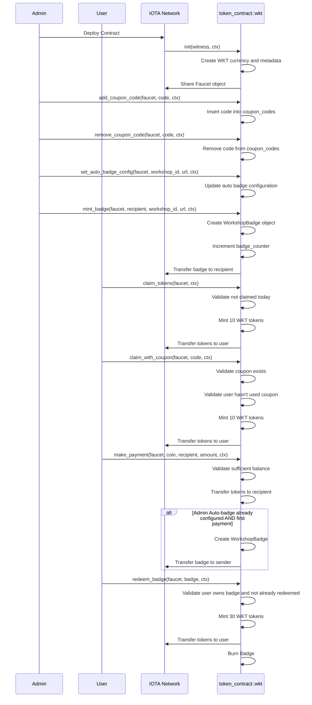

# Minting and Managing Tokens

In this tutorial, we build the WKT dApp — a decentralized Workshop Token and Badge system — using the Move language for blockchain contracts and the [IOTA dApp kit](../../developer/ts-sdk/dapp-kit/) for the frontend. The project starts with creating and deploying the [Move package](../getting-started/create-a-package.mdx) on the IOTA Network, then building the frontend dApp to enable wallet connection, daily token claims, coupon redemptions, peer payments with auto-badge minting, badge redemption, and admin controls using React and other libraries for routing and UI components. This tutorial demonstrates seamless integration between Move smart contracts and IOTA's frontend tools — using:

- **Move** smart contracts for blockchain logic
- **IOTA dApp Kit** for frontend interaction
- **React + Vite** for UI

**The dApp allows**:

- Daily token claims
- Coupon-based claims
- Peer-to-peer payments
- Auto and manual badge minting
- Badge redemption
- Admin management controls

## Prerequisites

- [Node.js](https://nodejs.org/en) >= v22.14.0
- [npx](https://www.npmjs.com/package/npx) >= 11.4.2
- [iota CLI](https://github.com/iotaledger/iota/releases) >= 1.5.0
- Basic knowledge of React and TypeScript


## Create a Move Package

We start by creating a Move package for our Workshop Token contract. This sets up the project structure, scaffolds the necessary files, and prepares the environment to implement blockchain logic. Once the package is created, we'll explore the package structure and understand how the token and badge functionality will be implemented.

Run the following command to [create a Move package](/developer/getting-started/create-a-package):

```bash
iota move new token_contract && cd token_contract
```

## Package Overview

### Struct and Constants

- [WKT](https://github.com/iota-community/workshops/blob/cf7b277a01da9e6e957dcca9f1671d88475c169c/workshop-module-7/token_contract/sources/token_contract.move#L9) - The main token type for Workshop Token as a fungible token type.
- [WorkshopBadge](https://github.com/iota-community/workshops/blob/cf7b277a01da9e6e957dcca9f1671d88475c169c/workshop-module-7/token_contract/sources/token_contract.move#L12-L18) - NFT badge struct containing recipient, minting timestamp, workshop ID, and metadata URL.
- [Faucet](https://github.com/iota-community/workshops/blob/cf7b277a01da9e6e957dcca9f1671d88475c169c/workshop-module-7/token_contract/sources/token_contract.move#L21-L33) - Main contract state storing treasury, admin address, claims, coupons, issued badges, auto badge config, and redemption tracking.


### Events

- [TokensClaimed](https://github.com/iota-community/workshops/blob/cf7b277a01da9e6e957dcca9f1671d88475c169c/workshop-module-7/token_contract/sources/token_contract.move#L36-L40) - Emitted on daily or coupon token claim.
- [ClaimStatus](https://github.com/iota-community/workshops/blob/cf7b277a01da9e6e957dcca9f1671d88475c169c/workshop-module-7/token_contract/sources/token_contract.move#L42-L45) - Emitted for claim status checks.
- [BadgeMinted](https://github.com/iota-community/workshops/blob/cf7b277a01da9e6e957dcca9f1671d88475c169c/workshop-module-7/token_contract/sources/token_contract.move#L47-L52) - Emitted when a badge NFT is minted.
- [BadgeRedeemed](https://github.com/iota-community/workshops/blob/cf7b277a01da9e6e957dcca9f1671d88475c169c/workshop-module-7/token_contract/sources/token_contract.move#L54-L57) - Emitted when a badge is redeemed (burned for tokens).
- [PaymentMade](https://github.com/iota-community/workshops/blob/cf7b277a01da9e6e957dcca9f1671d88475c169c/workshop-module-7/token_contract/sources/token_contract.move#L59-L63) - Emitted for peer-to-peer payments.

### Error Codes

- [EAlreadyClaimed](https://github.com/iota-community/workshops/blob/cf7b277a01da9e6e957dcca9f1671d88475c169c/workshop-module-7/token_contract/sources/token_contract.move#L65-L72) - User has already claimed tokens for the day
- [EInvalidCoupon](https://github.com/iota-community/workshops/blob/cf7b277a01da9e6e957dcca9f1671d88475c169c/workshop-module-7/token_contract/sources/token_contract.move#L65-L72) - Coupon code does not exist or is invalid
- [ECouponAlreadyUsed](https://github.com/iota-community/workshops/blob/cf7b277a01da9e6e957dcca9f1671d88475c169c/workshop-module-7/token_contract/sources/token_contract.move#L65-L72) - Coupon has already been redeemed by the user
- [ENotAdmin](https://github.com/iota-community/workshops/blob/cf7b277a01da9e6e957dcca9f1671d88475c169c/workshop-module-7/token_contract/sources/token_contract.move#L65-L72) - Caller is not the admin, unauthorized action
- [ENoBadge](https://github.com/iota-community/workshops/blob/cf7b277a01da9e6e957dcca9f1671d88475c169c/workshop-module-7/token_contract/sources/token_contract.move#L65-L72) - Badge does not belong to caller or is missing
- [EAlreadyRedeemed](https://github.com/iota-community/workshops/blob/cf7b277a01da9e6e957dcca9f1671d88475c169c/workshop-module-7/token_contract/sources/token_contract.move#L65-L72) - Badge already redeemed once by the user
- [EInsufficientBalance](https://github.com/iota-community/workshops/blob/cf7b277a01da9e6e957dcca9f1671d88475c169c/workshop-module-7/token_contract/sources/token_contract.move#L65-L72) - Insufficient WKT token balance to make payment

## Frontend Overview

After setting up the Move package, we build a frontend dApp to interact with our token contract. This section explains how to create a React project, connect it to the IOTA network, and provide interfaces for users and admins to claim tokens, redeem badges, and make payments.

### Set Up the Frontend dApp

Start by creating a new React project with Vite or your preferred tool (or from existing source).

First, create an initial react app using the following command:

```bash
pnpm create @iota/create-dapp
```

:::note

[IOTA dApp kit](../../developer/ts-sdk/dapp-kit/)

Select the following options when prompted:

Which starter template would you like to use? …
▸ `react-client-dapp` React Client dApp that reads data from wallet and the blockchain
▸ `react-e2e-counter` React dApp with a move smart contract that implements a distributed counter

you have to select `react-client-dapp`
:::

### Install required dependencies:

```bash
pnpm install
```

### Core dependencies include:

- `@iota/dapp-kit` for blockchain interaction and wallet connection

- `@radix-ui/themes` and `@radix-ui/react-tabs` for UI components and styling

- `react-router-dom` for client-side routing

- `@tanstack/react-query` for data fetching and caching


### Frontend folder/file Structure

```text
.
├── eslint.config.js
├── index.html
├── package.json
├── pnpm-lock.yaml
├── prettier.config.cjs
├── README.md
├── src
│   ├── App.tsx
│   ├── components
│   │   ├── AdminPanel.tsx
│   │   ├── BadgeGallery.tsx
│   │   ├── CelebrationModal.tsx
│   │   ├── ClaimCoupon.tsx
│   │   ├── ClaimTokens.tsx
│   │   ├── Home
│   │   │   ├── ActionTabs.tsx
│   │   │   ├── DashboardSummary.tsx
│   │   │   ├── Home.tsx
│   │   │   └── HomeStyles.css
│   │   ├── MakePayment.tsx
│   │   ├── molecules
│   │   │   ├── Button.tsx
│   │   │   ├── Loading.tsx
│   │   │   └── Tooltip.tsx
│   │   └── RedeemBadge.tsx
│   ├── hooks
│   │   └── useWKTContract.ts
│   ├── main.tsx
│   ├── networkConfig.ts
│   ├── OwnedObjects.tsx
│   ├── theme
│   │   └── darkTheme.ts
│   ├── types
│   │   └── index.ts
│   ├── utils
│   │   └── errorHandling.ts
│   ├── vite-env.d.ts
│   └── WalletStatus.tsx
├── tsconfig.json
├── tsconfig.node.json
└── vite.config.ts
```

The frontend source is organized as:

- `src/components` - Contains UI components for Dashboard, Claims, Payments, Badges, and Admin panel.
- `src/hooks` - Contains useWKTContract.ts custom hook to handle all blockchain calls.
- `src/utils` - Utility functions including error parsing.
- `src/types` - Shared type definitions.

### User Components

Key user components include:

- `DashboardSummary` - Overview of token balances and badges.
- `ActionTabs` - Tabs to switch between token/payment actions and badge/reward views.
- `OwnedObjects` - Lists badges and token info owned by the user.
- `ClaimTokens / ClaimCoupon` - Interfaces to claim tokens daily or via coupon code given by admin.
- `MakePayment` - Send tokens to another wallet with balance checks.
- `RedeemBadge` - Redeem earned badges for bonus tokens.
- `BadgeGallery` - Browse earned badges with redeem button.

### Admin Panel

- Manage coupon codes: Add or remove coupon codes.
- Configure auto badge minting settings.
- Manually mint badges to recipients.
- Admin-only access gated based on blockchain admin check.

### UI Styling and Feedback

- Consistent dark theme using Radix UI themes.
- Tooltips provide help and guidance.
- Success and error messages with icons and colors for clear feedback.
- Loading spinner for async operations and data fetching.

:::note

Below Set Up Network Configuration is to be done after complete implementation and deploying the Move package:

Make sure to replace `<YOUR_PACKAGE_ID>` and `<YOUR_FAUCET_Object_ID>` with actual object IDs from your deployment.

:::

### Set Up Network Configuration

Add the following variables in the [`networkConfig.ts`](https://github.com/iota-community/workshops/blob/main/workshop-module-7/workshop-token-frontend/src/networkConfig.ts) file:

```javascript reference
https://github.com/iota-community/workshops/blob/f9b9d70d6167e9da657a45640945e646bc3c06bc/workshop-module-7/workshop-token-frontend/src/networkConfig.ts#L1-L23
```

You should retrieve the shared objects from the transaction digest of the published package.

### Start Development Server

Run the dev server to launch your dApp locally:

```bash
pnpm run dev
```

- Open the provided URL (usually http://localhost:3000) in a browser to interact with the dApp.
- This section prepares the environment to launch the frontend connected to your deployed Move contract on IOTA.

## Implementation Section Layout

(**Smart Contract** -> **Frontend** (User/Admin Interactions) -> **Tests** For Move Package):

Our implementation follows this pattern for each feature:
- **Smart Contract** - Move Package Code with blockchain logic
- **Frontend** - User/Admin interactions through React components  
- **Tests** - Move package tests for validation

## Implementation Overview

We’ll now build the Workshop Token dApp step-by-step, adding one feature at a time.

For each feature:
1. We'll look at what the feature does in the dApp (with a screenshot).
2. Explore the corresponding **Move smart contract** logic.
3. Implement the **frontend interaction** using IOTA dApp Kit.
4. Verify with relevant **unit tests**.

## Initialization (init Function)

**Dashboard Interface of the dApp**

*This is the main dashboard view of the Workshop Token dApp after wallet connection. It displays the user’s connected address, token balances, badges, and quick access to claim, payment, and redemption actions and on each and every step tooltips are showcased for better user experience.*


The `init` function is called once at the contract deployment to set up the initial state of the WKT token ecosystem.

- Creates the WKT fungible token with metadata (name, symbol, description).
- Freezes token metadata to prevent modification after deployment.
- Initializes the shared `Faucet` object containing:
  - The token treasury cap for minting new WKT tokens.
  - Admin address set as contract deployer.
  - Empty tables and maps to track daily claims, coupons, badge issuance, and redemption.
  - Default empty strings for auto badge configuration.

- Shares the `Faucet` object on-chain to allow shared access during contract interactions.

**Move Package Code**:

```move reference
https://github.com/iota-community/workshops/blob/cf7b277a01da9e6e957dcca9f1671d88475c169c/workshop-module-7/token_contract/sources/token_contract.move#L74-L104
```

**Package Test code**:

```move reference
https://github.com/iota-community/workshops/blob/96ab4afde0218b858e91dc7b34f5f5e3c0dd8030/workshop-module-7/token_contract/tests/token_contract_tests.move#L1-L44
```

## Admin Functions

The admin manages the token economy. Here we describe how administrators can add/remove coupons, configure auto-badge settings, mint badges manually, and transfer admin rights — ensuring control and security within the system.

Admin functions provide the control panel for our token ecosystem, allowing authorized administrators to manage coupon distribution, configure badge settings, and maintain system security. These functions are protected to ensure only the contract admin can perform critical management operations.

Admin functions allow the authorized admin to manage coupon codes, badges, configurations, and transfer admin rights. Authorization is enforced by asserting the transaction sender matches the stored `faucet.admin` address.

### `Add Coupon Code`

Allows the admin to add a coupon code to the contract for token claims.

**Admin Panel Coupon Management Interface**

*Admin dashboard section for managing coupon codes — showing options to add, remove, and view available coupon codes for token rewards.*


**Move Package Code**:
```move reference
https://github.com/iota-community/workshops/blob/cf7b277a01da9e6e957dcca9f1671d88475c169c/workshop-module-7/token_contract/sources/token_contract.move#L106-L114
```
- Verifies sender is admin.
- Converts coupon code bytes to string.
- Inserts the coupon code as active into coupon_codes map.

### `Remove Coupon Code`

Allows the admin to remove a coupon code.

**Move Package Code**:
```move reference
https://github.com/iota-community/workshops/blob/cf7b277a01da9e6e957dcca9f1671d88475c169c/workshop-module-7/token_contract/sources/token_contract.move#L116-L124
```
- Checks admin authority.
- Removes the coupon code from coupon_codes.

### `Transfer Admin Rights`

Transfers the admin role to a new address.

**Move Package Code**:
```move reference
https://github.com/iota-community/workshops/blob/cf7b277a01da9e6e957dcca9f1671d88475c169c/workshop-module-7/token_contract/sources/token_contract.move#L126-L133
```
- Ensures only current admin can transfer adminship.
- Updates admin address in Faucet.

### `Set Auto Badge Configuration`

Configures the Workshop ID and URL for automatic badge minting on first payment.

**Admin Panel Auto Badge Configuration Interface**

*Admin view to configure automatic badge minting settings, including Workshop ID and badge metadata URL used when a user performs their first payment.*


**Move Package Code**:
```move reference
https://github.com/iota-community/workshops/blob/cf7b277a01da9e6e957dcca9f1671d88475c169c/workshop-module-7/token_contract/sources/token_contract.move#L135-L144
```
- Only admin can set.
- Updates the `auto_badge_workshop_id` and `auto_badge_url`.

### `Mint Badge`

Manually mints a WorkshopBadge NFT to a recipient.

**Admin Panel Manual Badge Minting Interface**

*Admin interface to manually mint Workshop Badge NFTs for specific recipients. It shows inputs for recipient address, workshop ID, and badge metadata link.*


**Move Package Code**:
```move reference
https://github.com/iota-community/workshops/blob/cf7b277a01da9e6e957dcca9f1671d88475c169c/workshop-module-7/token_contract/sources/token_contract.move#L146-L173
```
- Authorized admin only.
- Creates a new WorkshopBadge NFT object.
- Increments badge count.
- Transfers the badge to the recipient.
- Emits `BadgeMinted` event with badge details.

**Frontend Admin Interaction**:

**hook functions for Interaction**

```javascript reference
https://github.com/iota-community/workshops/blob/96ab4afde0218b858e91dc7b34f5f5e3c0dd8030/workshop-module-7/workshop-token-frontend/src/hooks/useWKTContract.ts#L21-L44
```

```javascript reference
https://github.com/iota-community/workshops/blob/96ab4afde0218b858e91dc7b34f5f5e3c0dd8030/workshop-module-7/workshop-token-frontend/src/hooks/useWKTContract.ts#L344-L464
```

**Admin Dashboard** [components/AdminPanel.tsx](https://github.com/iota-community/workshops/blob/main/workshop-module-7/workshop-token-frontend/src/components/AdminPanel.tsx)

- Accessible only to admin wallet addresses.
- Manage coupon codes (add/remove).
- Configure and update auto badge settings.
- Mint badges to users manually.
- Shows feedback on action outcomes.

```javascript reference
https://github.com/iota-community/workshops/blob/34cb987cf56ed174f392c372c8c4578d3478908f/workshop-module-7/workshop-token-frontend/src/components/AdminPanel.tsx#L1-L45
```

**Package Test code**:

```move reference
https://github.com/iota-community/workshops/blob/96ab4afde0218b858e91dc7b34f5f5e3c0dd8030/workshop-module-7/token_contract/tests/token_contract_tests.move#L47-L93
```

So by now we have completed the admin functions and their frontend interaction and added all these functionality to our dapp admin panel as shown in the ui images above.
- Add Coupon Code
- Remove Coupon Code
- Transfer Admin Rights
- Set Auto Badge Configuration
- Mint Badge

## User Functions

Users are the core participants of our token ecosystem. In this section, we explain how daily token claims, coupon redemption, badge redemption, and peer-to-peer payments are implemented both in the Move contract and in the frontend interface.

User functions form the core engagement layer of our dApp, enabling participants to acquire tokens, earn badges, and interact with each other. These functions create the vibrant token economy that drives user participation and community growth.

Users interact with the contract primarily through token claims, coupon redemption, badge redemption, and payments.

### Token Claim System

The token claim system provides two pathways for users to acquire WKT tokens: daily claims for regular engagement and coupon-based claims for targeted distribution. This dual approach balances consistent rewards with flexible promotional opportunities.

So now we will be adding to our dapp the claim daily tokens and claim coupon functions in the frontend as shown in the ui images below:-

### Daily Token Claim Faucet Interface

**Faucet Daily Token Claim Interface**

*User interface to claim 10 WKT tokens once per day. The button is active when the user hasn’t claimed tokens yet for the current UTC day.*


**Faucet Daily Claim Disabled Interface**

*Interface showing the daily claim button disabled after a successful token claim, indicating the cooldown until the next day.*


**Coupon Token Claim Interface**

*UI where users can enter a valid coupon code distributed by the admin to claim bonus WKT tokens.*


### `Claim Daily Tokens`

Allows users to claim 10 WKT tokens once per UTC day.

**Move Package Code**:
```move reference
https://github.com/iota-community/workshops/blob/cf7b277a01da9e6e957dcca9f1671d88475c169c/workshop-module-7/token_contract/sources/token_contract.move#L176-L201
```
- Verifies the user has not claimed today, enforcing once daily claims.
- Mints 10 WKT tokens and transfers to the caller.
- Emits a `TokensClaimed` event with claim details.

### `Claim Tokens with Coupon`

Enables users to claim tokens using an admin-issued coupon code.

**Move Package Code**:
```move reference
https://github.com/iota-community/workshops/blob/cf7b277a01da9e6e957dcca9f1671d88475c169c/workshop-module-7/token_contract/sources/token_contract.move#L203-L233
```
- Validates provided coupon exists and is unused by caller.
- Records coupon usage for the user to prevent reuse.
- Mints 10 WKT tokens and transfers them to the caller.
- Emits a `TokensClaimed` event marking the claim as coupon-based.

**Frontend User Interaction**:

**hook functions for Interaction**

`Claim Daily Tokens`

**hook functions for Interaction**

```javascript reference
https://github.com/iota-community/workshops/blob/96ab4afde0218b858e91dc7b34f5f5e3c0dd8030/workshop-module-7/workshop-token-frontend/src/hooks/useWKTContract.ts#L45-L79
```

```javascript reference
https://github.com/iota-community/workshops/blob/96ab4afde0218b858e91dc7b34f5f5e3c0dd8030/workshop-module-7/workshop-token-frontend/src/hooks/useWKTContract.ts#L223-L251
```

`Claim Tokens with Coupon`

**hook functions for Interaction**

```javascript reference
https://github.com/iota-community/workshops/blob/96ab4afde0218b858e91dc7b34f5f5e3c0dd8030/workshop-module-7/workshop-token-frontend/src/hooks/useWKTContract.ts#L252-L279
```

**Claim Interfaces** [components/ClaimTokens.tsx](https://github.com/iota-community/workshops/blob/main/workshop-module-7/workshop-token-frontend/src/components/ClaimTokens.tsx) and [components/ClaimCoupon.tsx](https://github.com/iota-community/workshops/blob/main/workshop-module-7/workshop-token-frontend/src/components/ClaimCoupon.tsx)

- UI forms for claiming daily tokens and redeeming coupons.
- Input validation, connection checks, and error/success message feedback.
- Utilizes `useWKTContract` hook functions for blockchain operations.

```javascript reference
https://github.com/iota-community/workshops/blob/34cb987cf56ed174f392c372c8c4578d3478908f/workshop-module-7/workshop-token-frontend/src/components/ClaimTokens.tsx#L1-L60
```

````javascript reference
https://github.com/iota-community/workshops/blob/34cb987cf56ed174f392c372c8c4578d3478908f/workshop-module-7/workshop-token-frontend/src/components/ClaimCoupon.tsx#L1-L60
````


**Package Test code**:

`Claim Daily Tokens`

```move reference
https://github.com/iota-community/workshops/blob/96ab4afde0218b858e91dc7b34f5f5e3c0dd8030/workshop-module-7/token_contract/tests/token_contract_tests.move#L94-L144
```
`Claim Tokens with Coupon`

```move reference
https://github.com/iota-community/workshops/blob/96ab4afde0218b858e91dc7b34f5f5e3c0dd8030/workshop-module-7/token_contract/tests/token_contract_tests.move#L146-L184
```

So by now we have added the claim daily tokens and claim coupon functions to our dapp as shown in the ui images above.

### Badge Redemption System

The badge redemption system allows users to convert their earned WorkshopBadge NFTs back into utility tokens, creating a circular economy where achievements can be monetized. This feature enhances badge value and provides additional utility for user accomplishments.

### `Redeem Badge`

Users can burn a WorkshopBadge NFT to redeem 30 WKT tokens.

So now we will be adding to our dapp the redeem badge and badge gallery functionality in the frontend as shown in the ui images below:-

**Redeem Badge Interface**

*Interface where users can select a badge ID they own and redeem it for WKT tokens.*


**Already Redeemed Badge Interface**

*Confirmation screen indicating that a badge has already been redeemed and cannot be used again.*


**Badge Gallery Interface**

*Gallery displaying all Workshop Badges owned by the user, with options to view details or redeem eligible badges.*


**Move Package Code**:

```move reference
https://github.com/iota-community/workshops/blob/cf7b277a01da9e6e957dcca9f1671d88475c169c/workshop-module-7/token_contract/sources/token_contract.move#L235-L256
```
- Checks badge ownership and ensures one-time redemption.
- Mints and transfers 30 WKT tokens to the caller.
- Marks badge as redeemed and deletes the badge NFT from storage.
- Emits a `BadgeRedeemed` event.

**Frontend User Interaction**:

**hook functions for Interaction**

```javascript reference
https://github.com/iota-community/workshops/blob/96ab4afde0218b858e91dc7b34f5f5e3c0dd8030/workshop-module-7/workshop-token-frontend/src/hooks/useWKTContract.ts#L80-L107
```

```javascript reference
https://github.com/iota-community/workshops/blob/96ab4afde0218b858e91dc7b34f5f5e3c0dd8030/workshop-module-7/workshop-token-frontend/src/hooks/useWKTContract.ts#L165-L198
```

```javascript reference
https://github.com/iota-community/workshops/blob/96ab4afde0218b858e91dc7b34f5f5e3c0dd8030/workshop-module-7/workshop-token-frontend/src/hooks/useWKTContract.ts#L315-L342
```

**Badge Management** [components/BadgeGallery.tsx](https://github.com/iota-community/workshops/blob/main/workshop-module-7/workshop-token-frontend/src/components/BadgeGallery.tsx) and [components/RedeemBadge.tsx](https://github.com/iota-community/workshops/blob/main/workshop-module-7/workshop-token-frontend/src/components/RedeemBadge.tsx)

- Badge Gallery displays all badges earned with images, minting dates, and badge IDs.
- Badge Redeem component allows redeeming badges for WKT tokens with one-time restriction.
- Includes error and state messaging guiding the user.

```javascript reference
https://github.com/iota-community/workshops/blob/34cb987cf56ed174f392c372c8c4578d3478908f/workshop-module-7/workshop-token-frontend/src/components/RedeemBadge.tsx#L1-L15
```

```javascript reference
https://github.com/iota-community/workshops/blob/34cb987cf56ed174f392c372c8c4578d3478908f/workshop-module-7/workshop-token-frontend/src/components/BadgeGallery.tsx#L1-L11
```

**Package Test code**:

```move reference
https://github.com/iota-community/workshops/blob/96ab4afde0218b858e91dc7b34f5f5e3c0dd8030/workshop-module-7/token_contract/tests/token_contract_tests.move#L186-L273
```

#### Peer-to-Peer Payments System (with Auto Badge Minting on their First Payment)

The payment system enables direct token transfers between users, with optional automatic badge minting to reward first-time transactions. This creates a complete economic ecosystem where users can exchange value while earning recognition for their participation.

So now we will be adding to our dapp the make payment function in the frontend as shown in the ui images below:-

### Make Payment Interface and confetti on new badge mint

**Make Payment Interface**

*Payment screen that allows users to transfer WKT tokens to another wallet address, with balance checks and confirmation feedback.*


**Confetti Celebration on New Badge Mint**

*Celebration modal with confetti animation that appears when a user earns their first Workshop Badge automatically after making a payment.*


### `Make Payment`

Facilitates peer-to-peer payments with WKT tokens and auto-badge minting on first payment if admin had configured the nft badge from there end.

**Move Package Code**:

```move reference
https://github.com/iota-community/workshops/blob/cf7b277a01da9e6e957dcca9f1671d88475c169c/workshop-module-7/token_contract/sources/token_contract.move#L258-L304
```

- Checks the sender has sufficient balance.
- Splits the coin and transfers the payment to the recipient.
- Emits `PaymentMade` event.
- Auto-mints a WorkshopBadge if it is the sender's first payment and auto-badge config is set.
- Records badge issuance and emits `BadgeMinted` event.

**Frontend User Interaction**:

**hook functions for Interaction**

```javascript reference
https://github.com/iota-community/workshops/blob/96ab4afde0218b858e91dc7b34f5f5e3c0dd8030/workshop-module-7/workshop-token-frontend/src/hooks/useWKTContract.ts#L281-L313
```


**Payment Component** [components/MakePayment.tsx](https://github.com/iota-community/workshops/blob/main/workshop-module-7/workshop-token-frontend/src/components/MakePayment.tsx)

- Form for sending WKT tokens to other addresses.
- Shows current token balance and processes payments.
- After payments, checks and displays newly minted badges if any.
- Shows celebratory confetti modal on new badge mint.

```javascript reference
https://github.com/iota-community/workshops/blob/34cb987cf56ed174f392c372c8c4578d3478908f/workshop-module-7/workshop-token-frontend/src/components/MakePayment.tsx#L1-L80
```

**Package Test code**:

```move reference
https://github.com/iota-community/workshops/blob/96ab4afde0218b858e91dc7b34f5f5e3c0dd8030/workshop-module-7/token_contract/tests/token_contract_tests.move#L275-L334
```

## Run Unit Tests

You can use the following command in the package root to run any unit tests you have created.

```shell
iota move test
```

## Publish the Package

[Publish](../getting-started/publish.mdx) the package to the IOTA Network using the following command:

```shell 
iota client publish
```

## Complete Source Code (Frontend and Move Package Contract + Tests)

## Complete Source Code

### Frontend Application

**Source Code Repository:** [workshop-token-frontend](https://github.com/iota-community/workshops/tree/main/workshop-module-7/workshop-token-frontend)

**Live Demo:** [Workshop Token dApp Frontend](https://workshops-token-frontend.vercel.app/)

### Move Smart Contract

**Contract Source Code:** [token_contract.move](https://github.com/iota-community/workshops/blob/main/workshop-module-7/token_contract/sources/token_contract.move)

**Contract Tests:** [token_contract_tests.move](https://github.com/iota-community/workshops/blob/main/workshop-module-7/token_contract/tests/token_contract_tests.move)


## Sequence Diagram

This sequence diagram illustrates the flow of interactions within the WKT (Workshop Token) decentralized application involving the Admin, User, Blockchain, and the token_contract::wkt Move smart contract. The process begins with the Admin deploying the contract to the IOTA Network, which initializes the WKT token, metadata, and shared Faucet object for token distribution. Users can claim daily tokens, with the contract ensuring claims are limited to once per day, and claim tokens using unique coupons managed by the Admin through a coupon registry.

Users can make peer-to-peer payments with WKT tokens, where the contract validates balances and transfers coins to recipients. If configured, the contract automatically mints a WorkshopBadge NFT for the user on their first payment. Badge redemption allows users to burn their WorkshopBadge NFTs to receive 30 WKT tokens, with ownership and one-time redemption enforced by the contract.

The Admin manages coupon codes, configures auto-badge settings, and manually mints badges to recipients. Administrative controls also include transferring admin rights securely. Throughout these interactions, the contract emits events to signal token claims, payments, badge minting, and redemptions, ensuring transparency and synchronization with the front end. This diagram demonstrates how the system maintains secure token flows, proper validations, and flexible administrative oversight on the blockchain.




## Conclusion

The Workshop Minting Managing Tokens (WKT) tutorial focuses on custom token management using the IOTA blockchain and the Move programming language. It guides developers through defining, minting, and managing fungible tokens and NFTs tailored for workshops and events. Key features include daily token claims, coupon-based distribution, peer-to-peer payments, and badge rewards as NFTs. The tutorial highlights secure admin controls, event-driven contract design, and robust error handling. Complemented by a modern frontend built with React and the IOTA dApp kit, it demonstrates seamless blockchain integration with user-friendly interfaces. This hands-on guide equips developers to create scalable, feeless token ecosystems fostering engagement and rewarding participation on the IOTA network.

## Extension Tasks

### 🚀 Build a Token Management/Creator Platform

Transform your token system into a platform where users can launch their own branded token ecosystems. Create a factory contract that lets anyone deploy custom workshop tokens with unique names, symbols, and economic models.

**Build These Advanced Features:**

- **Multi-token factory system** for custom currency creation
- **Dynamic badge tiers** like (Bronze/Silver/Gold) with collection bonuses  
- **Recurring payments** and scheduled token distributions
- **Creator analytics dashboard** with real-time metrics

**Technical Challenges:**

- Factory contract patterns for token deployment
- Dynamic NFT metadata and tier systems
- Time-based payment schedulers
- Multi-token economic balancing

This extension transforms you from dApp builder to platform architect, teaching advanced Web3 patterns while creating real business value.

---

**Need help or want to collaborate?** Join the [IOTA Builders Discord](https://discord.gg/iota-builders) to share progress, get feedback on economic models, and solve technical challenges with the community. Share your factory designs and creator dashboards!