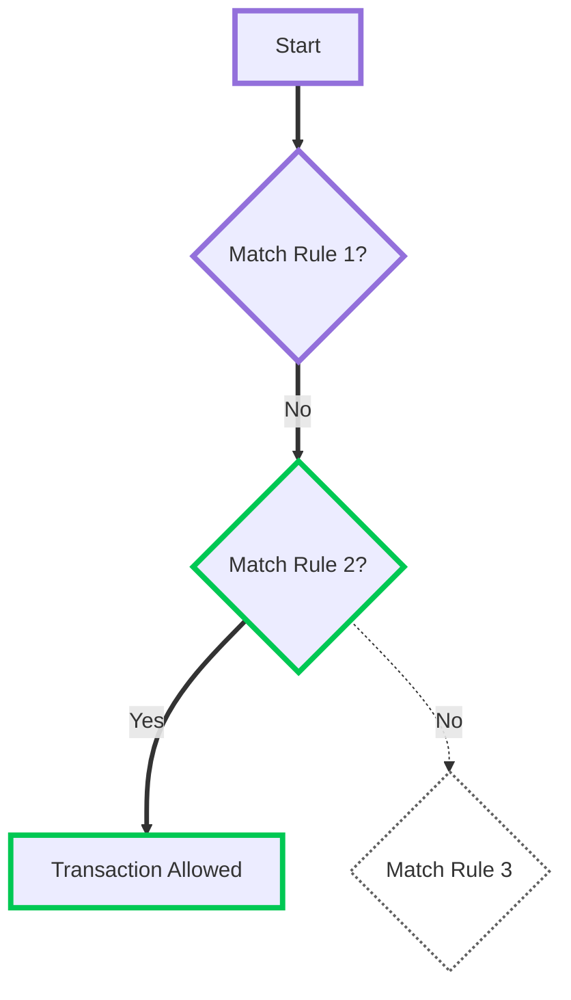
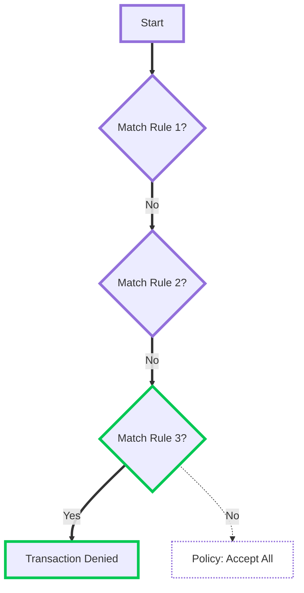
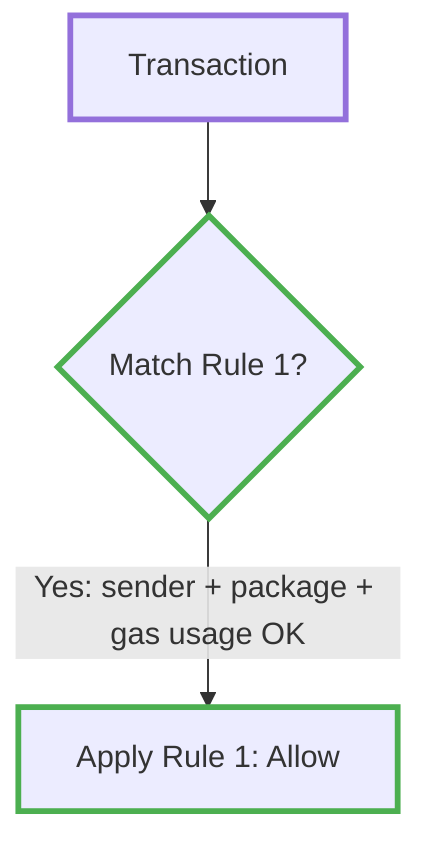
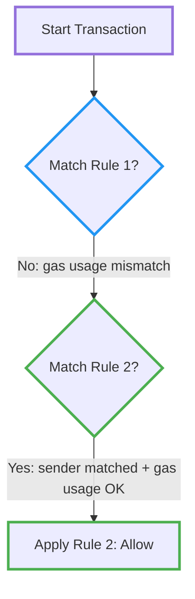
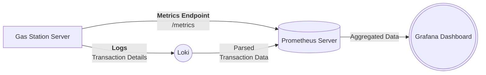

## Access Controller

The **Access Controller** is a rule-based system that regulates access to the `/execute_tx` endpoint. Similar to firewalls, it enforces policies to determine which transactions are allowed or denied.

### Access Policy Modes

The Access Controller operates in one of two modes:

* **Deny All:** A strict security model where all transactions are blocked by default. Rules must be explicitly defined to allow specific transactions.
* **Allow All:** A more permissive model where all transactions are allowed by default. Rules are used to selectively deny certain transactions.

:::warning Important Note
While the **`/reserve_gas`** endpoint remains unprotected by the ACL, potential abuse (such as multiple reservation attacks) is mitigated through configuration options like maximum reservation limits and expiration times.
:::

### Rule Processing

The Access Controller processes rules sequentially, much like rule-based filtering systems such as firewalls. Each rule is evaluated in order, and once a matching rule is found, its action is applied, preventing further rules from being checked. This ensures predictable behavior where the most specific rules are placed earlier, while broader rules serve as fallbacks.

When a transaction is submitted, the Access Controller starts by checking the first rule in the list. If the transaction matches the conditions set in that rule, the corresponding action is taken, either allowing or denying the transaction. If no match is found, the system proceeds to the next rule in sequence. This process continues until either a rule applies or no rules match, in which case the system falls back to the default policy (either **Allow All** or **Deny All**).

#### Example

For example, consider the following **Allow All** policy configuration with three rules:

```yaml
# Rule 1
- sender-address: "0x0202020202020202020202020202020202020202020202020202020202020202"
  transaction-gas-budget: "<=500000"
  action: allow

# Rule 2
- sender-address: "0x0101010101010101010101010101010101010101010101010101010101010101"
  transaction-gas-budget: "<=10000000"
  action: allow

# Rule 3
- sender-address: "*"
  action: deny
```

Rule 1: Allow transactions from 0x0202... with a gas budget ≤ 500000\.

Rule 2: Allow transactions from 0x0101... with a gas budget ≤ 1000000\.

Rule 3: Deny all other transactions.

#### Evaluation Example 1

A sender `0x0101...` submits a transaction with a `900000` gas budget. The system evaluates `Rule 1` first but skips it since the sender’s address does not match. `Rule 2` is then checked, and since both the sender and gas budget conditions are satisfied, the transaction is allowed.



**Explanation:**

| rule   | explanation                                                                 |
|--------|-----------------------------------------------------------------------------|
| Rule 1 | Checked first but skipped as the sender doesn’t match.                      |
| Rule 2 | Evaluated, and since the sender and budget match, the transaction is **allowed**. |
| Rule 3 | Never reached because Rule 2 applied.                                       |


#### Evaluation Example 2

A sender `0x0303...` submits a transaction with a `400000` gas budget. The system evaluates `Rule 1` and `Rule 2` but skips both as the sender’s address does not match. The final `Rule 3` is then evaluated, which applies to all remaining transactions, resulting in the transaction being denied.




**Explanation:**

| rule   | explanation                                                            |
|--------|------------------------------------------------------------------------|
| Rule 1 | Checked but skipped.                                                   |
| Rule 2 | Evaluated but skipped as well.                                         |
| Rule 3 | Applies to all other cases, so the transaction is **denied**.          |

---

### Gas Usage Limiting

One of the Access Controller's most useful capabilities is its built-in mechanism for tracking gas usage across all gas station instances. Redis-backed counters synchronize limits cluster-wide, making this possible. Let's explore this feature with a practical example.

:::warning Gas Usage is a Matcher
 `gas-usage` is a matcher, not an action. It works with other matchers, and only when all matchers match is the rule's action applied.
:::

#### Daily Gas Limit Per Account

Suppose you want to ensure that no individual sender can consume more than 1,000,000 gas units daily. You can define this rule as follows:

```yaml
access-controller:
  access-policy: deny-all
  rules:
    - sender-address: "*"
      gas-usage:
        value: "<1000000"
        window: 1day
        count-by: [ sender-address ]
      action: allow
```

Here's what happens:

* The access policy is set to `deny-all`, meaning only explicitly allowed transactions are processed.
* The rule matches any sender address.
* The `gas-usage` condition specifies a 1-day rolling window and limits usage to below 1,000,000 gas units per address.
* The `count-by: [ sender-address ]` clause ensures that each sender's gas usage is tracked and limited separately.

##### Why `count-by` is Important

The `count-by` field is crucial for isolating gas usage limits per sender address. It ensures that each sender has an independent gas usage counter, preventing one user's activity from affecting another's access to the gas station.
This is particularly important in scenarios where multiple users interact with the gas station simultaneously. If `count-by` were omitted, the gas usage would be aggregated across all senders, leading to potential abuse or unfair distribution of resources.
This means that if one user consumes a significant portion of the gas limit, it does not impact other users' ability to access the gas station. Each sender's gas usage is tracked independently, allowing fair and equitable resource access.


#### Combining Multiple Rules with Separate Counters

You can define multiple rules with independent gas usage counters. Each rule is evaluated individually and maintains its gas usage state, enabling precise control over different conditions.

```yaml
rules:
  - sender-address: "0x0202020202020202020202020202020202020202020202020202020202020202"
    move-call-package-address: "0x0101010101010101010101010101010101010101010101010101010101010101"
    gas-usage:
      value: "<1500000"
      window: 1day
    action: allow

  - sender-address: "*"
    gas-usage:
      value: "<1000000"
      window: 1day
      count-by: [ sender-address ]
    action: allow
```

Let’s walk through how the transaction processing works with this setup:

Suppose an account with the address `0x0202...` initiates a transaction targeting the package `0x0101...`. If the transaction requires, for instance, 1,400,000 gas units, it will be accepted by the **first rule** because:

* The sender's address matches exactly.
* The package address matches.
* The gas requirement is below the 1,500,000 limit.



Now, imagine the same account initiates another transaction, this time requiring 1,000,000 gas units. The **first rule** does not apply because the `gas-limit` matcher would be above the 1,500,000. The transaction then proceeds to the **second rule**, which:

* Matches any sender address (`"*"`).
* Tracks gas usage individually using `count-by: [ sender-address ]`.
* Confirms the daily usage is still under 1,000,000 for this sender.

The second rule is applied in this case, and the transaction is accepted.



Each rule with a gas-usage matcher defines its isolated gas usage counter. No gas usage data is shared between rules.
Understanding this evaluation flow is critical when building multi-tiered access policies with fallback logic.

#### Performance Considerations

Every gas-usage rule results in two Redis operations per transaction, introducing potential I/O bottlenecks. To mitigate Redis pressure, evaluate the number and specificity of rules for high-throughput setups. Optimizations are planned for future releases.

### Rego Expressions

From version `0.2`, the Access Controller in Gas Stations supports matching using the Rego language. This enables more complex filtering, especially when multiple nested transaction attributes must be inspected.

#### Example Rego Predicate

Let's extend the previous example with a Rego predicate that checks for a specific Move Call package address, function name, and argument.
To do this, you can create a Rego script that defines a rule to match the Move Call transaction attributes.

```go
package matchers

default move_call_matches = false

move_call_matches if {
    cmds := input.transaction_data.V1.kind.ProgrammableTransaction.commands
    count(cmds) == 1

    mc := cmds[0].MoveCall
    mc["package"] == "0xb674e2ed79db3c25fa4c00d5c7d62a9c18089e1fc4c2de5b5ee8b2836a85ae26"
    mc.module == "allowed_module_name"
    mc.function == "allowed_function_name"

    argv_1 := input.transaction_data.V1.kind.ProgrammableTransaction.input.Pure
    bcs.decode_typed(argv_1, "string") == "allowed_argument_value"
}
```
For more information on Rego syntax and capabilities, refer to the [Rego documentation](https://www.openpolicyagent.org/docs/policy-language/).
Refer to [Gas Station Server repository](https://github.com/iotaledger/gas-station/blob/dev/docs/access-controller.md#rego-expression-sources) for detailed config syntax and more examples.


#### Using Rego in Access Controller

Rego can be used as the `rego-expression` matcher in the Access Controller. It allows you to define complex rules that evaluate transaction attributes, such as commands, package addresses, and function names.

:::warning
rego expressions are compiled at the start of the Gas Station Server. Therefore the changes in the source location (`file`, `redis`, or `http`) will not be applied until the server is restarted or the [`/v1/reload_access_controller`](../api-reference/api-reference.mdx#reload-access-controller) API endpoint is called.
:::

```yaml
rules:
  - sender-address: "0x0202020202020202020202020202020202020202020202020202020202020202"
    rego-expression:
      location-type: redis
      url: "redis://localhost:6379"
      redis-key: "id:matcher"
      rego-rule-path: data.matchers.move_call_matches
    gas-usage:
      value: "<1500000"
      window: 1day
    action: allow
```

Supported `location-type` values:

* `file` - local file
* `redis` - Redis stored
* `http` - download from remote URL

Refer to [Gas Station Server repository](https://github.com/iotaledger/gas-station/blob/dev/docs/access-controller.md#rego-expression-sources) for detailed config syntax and more examples.


### External Filtering with Hooks

Access Controller allows decision delegation via HTTP hooks if predicates and Rego rules are insufficient. A hook is a remote service that receives the transaction payload and returns a decision.

The hook can be used to implement complex logic, such as checking external databases, performing additional validations, or integrating with third-party services.

The hook is another type of `action` in the rule definition. It is executed when the rule matches and the hook's response determines the following action.

#### Example Hook Usage

```yaml
rules:
  - move-call-package-address: "0x0101010101010101010101010101010101010101010101010101010101010101"
    ptb-command-count: "<=1"
    action: "https://hook.addr"

  - sender-address: "*"
    gas-usage:
      value: "<1000000"
      window: 1day
      count-by: [ sender-address ]
    action: allow
```

This configuration sends matching transactions (package address `0x0101...`) to a webhook and falls back to the gas-usage rule if the hook returns `noDecision`.

#### Decision Schema

The hook must return a JSON response with the following structure:

```json
{
  "decision": "allow|deny|noDecision"
}
```

* `allow` or `deny`: immediately apply decision and stop processing further rules.
* `noDecision`: skip this rule and evaluate the next one.

:::info
For up-to-date information on the hook response schema, refer to the OpenAPI specification at [Github](https://github.com/iotaledger/gas-station/blob/dev/docs/hook-openapi.json).
:::

#### Hook Implementation Example

To implement a custom hook, use the example in the [Gas Station Server repository](https://github.com/iotaledger/gas-station/tree/dev/examples/hook).


### Dynamic Reloading

The Access Controller does not automatically reload external resources at runtime. To apply changes in Rego scripts, Redis-stored matchers, or hook logic, you must call the [`/v1/reload_access_controller`](../api-reference/api-reference.mdx#reload-access-controller) API endpoint. This endpoint triggers a reload of the Access Controller configuration, allowing you to update rules, matchers, and hooks without restarting the Gas Station Server.

:::warning
Please note that the Access Controller doesn't protect the endpoint, so it should be secured with proper authentication mechanisms to prevent unauthorized access.
:::

---

## Monitoring & Analytics

### Prometheus Metrics

To ensure smooth operations, the **Gas Station Server** exposes a **Prometheus metrics** endpoint (`/metrics`). These metrics provide valuable insights into system performance, resource utilization, and transaction throughput. When running multiple Gas Station Servers, an external **Prometheus Server** is recommended for centralized data aggregation and visualization.

### In-depth Monitoring & Traffic Analysis

For deeper insights, developers can enable **transaction effect logging** by setting `TRANSACTIONS_LOGGING=true`. This feature allows external analytics tools such as **Elasticsearch, Splunk, or Datadog** to parse and analyze transaction data.

By logging every signed transaction, developers can:

* Track transaction sources and patterns.
* Analyze gas station usage over time.
* Detect anomalies or suspicious activity in real time.

### Example of integration



A typical scenario involves **analyzing transaction performance** to detect anomalies or improve resource allocation. The **Gas Station Server** continuously generates two key data sources:

1. **Logs** – Capturing transaction events and potential errors, which are forwarded to **Loki** for structured logging.
2. **Metrics** – Exposing system performance details via the **Prometheus metrics endpoint** (`/metrics`), which is periodically scraped by a **Prometheus Server**.

Since Loki integrates with **Prometheus**, structured log data is made available alongside real-time metrics. **Grafana** then queries **Prometheus** to visualize both system performance trends and transaction behaviors.

For example, if a sudden surge in transactions is detected, developers can **cross-reference logs with performance metrics** in Grafana to determine whether the increase is due to organic growth or potential spam activity. If anomalies are found, rate-limiting mechanisms or access control adjustments can be made accordingly.

This architecture ensures that the **Gas Station remains scalable, efficient, and secure** while providing real-time insights for continuous improvement.

